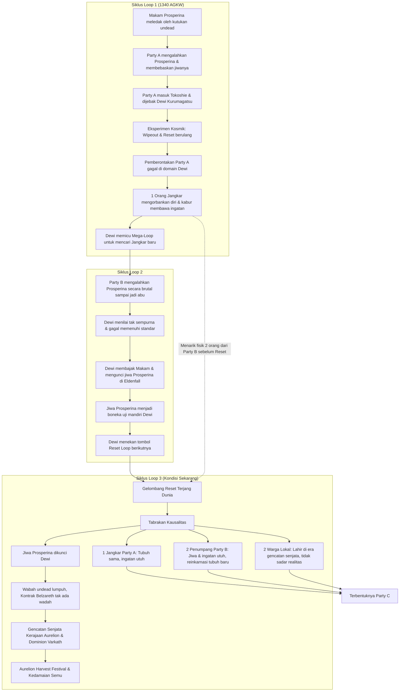

# ☀️ Lore Kerajaan Aurelion: Siklus Waktu & Kausalitas

*Benua Solmarch — Skenario Aurelion [REVISED]*

---

## 🌀 Bagan Alir Hubungan Siklus Loop

---

## 📜 Detail Skenario Aurelion

### 🌀 Siklus Loop 1: Tragedi Party A, Pemberontakan, dan Motif Rahasia Dewi

Semuanya bermula di tahun **1340 AGKW** ketika makam pahlawan kuno Prosperina di Eldenfall meledak oleh kutukan *undead*. **Party A** maju menghadapi ancaman tersebut, mengalahkan Prosperina, dan berhasil membebaskan jiwanya dari kontrak iblis Belzareth.

Namun, begitu mereka melangkah keluar dari makam dan masuk ke Kerajaan Keabadian (Tokoshie), mereka dijebak oleh **Dewi Keabadian (Kurumagatsu)** untuk dijadikan subjek eksperimen kosmik dan baterai **"Jangkar"** waktu. **Jangkar** ini bertindak sebagai pembatas (*restriction*) bagi Dewi Keabadian; tanpa adanya Jangkar aktif sebagai tumpuan kausalitas, sang Dewi tidak akan memiliki kekuatan untuk memutar atau me-*looping* waktu. Di sana, mereka terkena *wipeout* (mati) dan di-*reset* terus-menerus dalam siklus pengejaran kesempurnaan absolut milik sang Dewi.

Sadar bahwa mereka hanya dijadikan komponen abadi, Party A melakukan pemberontakan. Namun, **pemberontakan tersebut gagal total** karena kekuatan Dewi terlalu perkasa di domainnya. Di ambang kehancuran total, Party A mengambil langkah nekat: mereka mengorbankan diri demi mengutus **1 orang untuk kabur menembus ruang-waktu** ke dunia luar membawa memori asli mereka.

> [!NOTE]
> **Eksistensi Jangkar & Mega-Loop**
> Melihat pelarian itu, Dewi Keabadian menyadari kalkulasi kesempurnaannya cacat. Mengetahui si pelarian adalah **Jangkar terakhir** yang tersisa, sang Dewi sengaja **menggunakan esensi si Jangkar yang kabur sebagai pemantik paksa untuk melakukan *mega-loop***—menarik mundur seluruh garis waktu dunia luar jauh ke belakang ke titik sebelum pertarungan melawan Prosperina dimulai.
>
> **Motif Dewi:** Sang Dewi ingin memanfaatkan sisa eksistensi Jangkar A yang kabur untuk memutar waktu demi **mencari kandidat Jangkar baru** yang jauh lebih kuat dan sempurna di *loop* selanjutnya.

---

### ⚡ Siklus Loop 2: Kegagalan Party B & Pembajakan Makam

Di dalam realitas baru pasca *mega-loop*, dunia luar berjalan dengan takdir yang bergeser. Kali ini, giliran **Party B** yang tiba di makam Prosperina. Mereka berhasil menang, namun dengan cara yang brutal—langsung menghancurkan Prosperina menjadi abu tanpa pernah mencoba berdialog atau memastikan kematiannya secara tuntas.

Bagi Dewi Keabadian yang perfeksionis, cara ini dinilai cacat dan gagal memenuhi standar kesempurnaan.

Namun, di momen rentan saat tubuh Prosperina hancur menjadi abu, Dewi Keabadian langsung mengintervensi dunia luar. Sang Dewi membajak makam tersebut, lalu **mengekang dan mengunci jiwa Prosperina tepat di dalam makamnya sendiri di Eldenfall**.

Dewi mengubah fungsi jiwa Prosperina menjadi boneka penguji mandiri yang dikendalikan penuh oleh kesadaran sang Dewi sendiri, demi menyaring petualang baru (kandidat Jangkar) yang jauh lebih tangguh di *loop* berikutnya. Begitu proses penguncian jiwa selesai, Dewi Keabadian kembali menekan tombol *looping*.

---

### ⏳ Siklus Loop 3: Penarikan Jiwa Kosmik & Terciptanya Kedamaian Semu

Di sinilah momen krusial itu terjadi. Si Jangkar dari Party A yang berada di luar ruang-waktu **sudah merasakan bahwa riak anomali *looping* akan terjadi sekali lagi**. Sebelum kilatan *reset* realitas itu menghantam, dalam sepersekian detik kosmik, si Jangkar dengan cepat **meraih dan menarik fisik dua orang dari Party B** yang saat itu berada di dekatnya.

> [!IMPORTANT]
> **Dampak Tabrakan Kausalitas pada Karakter:**
> * **Si Jangkar (Party A):** Karena dia adalah Jangkar sah yang memicu *mega-loop* pertama, ruang dan waktu melindunginya. Dia terbangun dengan **tubuh yang sama dan ingatan yang utuh**.
> * **Dua Penumpang (Party B):** Karena mereka bukan Jangkar sah, hukum waktu menolak mereplikasi fisik mereka yang lama. Tubuh asli mereka terhapus oleh *reset*, namun karena jiwa mereka sempat "dipegang" oleh si Jangkar saat transisi, **jiwa dan ingatan lama mereka berhasil lolos dari penghapusan waktu**. Akibatnya, jiwa mereka terseret dan dipaksa **bereinkarnasi ke dalam tubuh baru yang sama sekali berbeda** di garis waktu yang baru ini.

Intervensi Dewi yang mengekang jiwa Prosperina di dalam makam pada *loop* sebelumnya membawa dampak *butterfly effect* yang masif ke dunia luar:

* 🛡️ **Lumpuhnya Kontrak Iblis:** Karena jiwa Prosperina telah disita dan dikunci oleh kekuatan Dewi Keabadian, kontrak iblis Belzareth kehilangan wadah utamanya di makam. Ledakan wabah *undead* yang seharusnya menghancurkan kota Eldenfall dan Graymere di tahun 1340 AGKW tidak pernah terjadi.
* 🤝 **Terciptanya Gencatan Senjata:** Tanpa adanya ancaman kosmik *undead* yang menguras logistik dan moral bangsa, konflik konvensional antara Kerajaan Aurelion dan Dominion Varkath mereda. Kedua kerajaan setuju untuk mengambil jalan **gencatan senjata (damai bersyarat)**.

Dunia luar tiba-tiba menjadi damai, dan Aurelion pun menggelar perayaan megah **Aurelion Harvest Festival**.

---

## 👥 Komposisi Anggota Party C (Siklus Saat Ini)

Di sinilah kelima orang ini akhirnya dipertemukan oleh takdir baru dalam **Party C**:

| No | Tipe Karakter | Deskripsi Asal & Kondisi Saat Ini |
|---|---|---|
| **1** | **1 Orang Jangkar (Party A)** | Berasal dari **Party A**. Terbangun dengan tubuh yang sama dan ingatan utuh tentang kegagalan pemberontakan di Tokoshie. Membawa beban berat sebagai pelarian waktu. |
| **2** | **2 Penumpang Memori (Party B)** | Berasal dari **Party B**. Memiliki jiwa dan ingatan lama tentang pertarungan brutal di makam Prosperina, namun dipaksa bereinkarnasi ke dalam wadah/tubuh baru yang asing akibat reinkarnasi paksa. |
| **3** | **2 Warga Asli (Oblivious)** | Warga asli dunia baru yang lahir dan hanya mengetahui kedamaian era gencatan senjata ini. Sama sekali tidak menyadari bahwa dunia indah tempat mereka berdiri sebenarnya adalah sangkar emas yang sedang menunggu giliran untuk di-*reset* kembali oleh sang Dewi. |

---

## 🕰️ Timeline Resmi (Kanon Baru)

* **1300 AGKW — Puncak Kejayaan & Akhir Perang Pertama**
  Perang besar pertama antara **Kerajaan Aurelion** dan **Dominion Varkath** mencapai puncaknya. Aurelion berhasil memenangkan peperangan ini berkat kekuatan luar biasa dari **Prosperina** beserta party pahlawannya, yang membawa kejayaan mutlak bagi kerajaan.
* **1310 AGKW — Pengkhianatan & Penulisan Ulang Sejarah**
  Dominion Varkath yang kalah secara militer berhasil menanamkan fitnah dan benih Paranoia ke dalam lingkaran dalam Kerajaan Aurelion. Akibat rasa takut dan paranoia raja, **Prosperina dan seluruh partynya dieksekusi secara bersamaan**.
  
  Kerajaan Aurelion kemudian melakukan rekayasa sejarah massal, mencatat di dokumen publik bahwa mereka gugur dengan terhormat melawan musuh di medan perang, dan menutup rapat-rapat fakta eksekusi yang memalukan ini dalam arsip militer rahasia (*The Old Ledger*).
* **1312 AGKW — Invasi II & Kejatuhan Aurelion**
  Kehilangan pahlawan terkuat dan figur militer utama mereka, pertahanan Kerajaan Aurelion melemah drastis. Dominion Varkath melihat celah pertahanan yang menganga ini dan langsung melancarkan **invasi kedua**.
* **1320 AGKW — Kemenangan Varkath & Era Damai Bersyarat**
  Setelah delapan tahun peperangan yang melelahkan dan menguras habis sumber daya, Varkath memenangkan perang berkepanjangan ini. Dunia akhirnya memasuki era gencatan senjata dan kedamaian bersyarat yang menekan kedaulatan Aurelion.
* **7 Kythorn 1340 AGKW — Masa Kini (Dimulainya Campaign / Loop 3)**
  Tepat tiga puluh tahun sejak eksekusi rahasia Prosperina. **Aurelion Harvest Festival** sedang digelar secara megah untuk merayakan "Tahun Kedamaian" di seluruh penjuru negeri.
  
  Di sinilah **Party C terbentuk**, menemukan buku arsip tua berumur 30 tahun (*The Old Ledger*) yang usang di Brackenford, dan menyadari bahwa sejarah agung yang dirayakan hari ini adalah kebohongan besar.

---

# 🏰 Skenario Highspire: Sangkar Emas

## 🌟 Kondisi Awal

Highspire, kota besar pusat administratif Kerajaan Aurelion, sedang merayakan **Aurelion Harvest Festival**. Pesta ini adalah perayaan "Tahun Kedamaian" antara Aurelion dan Dominion Varkath. Suasana sangat meriah: bendera kedua faksi berkibar bersama, musik megah mengalun di penjuru kota, namun bagi mereka yang peka, kedamaian ini terasa terlalu dipaksakan dan tidak wajar.

---

## 🎬 Alur Scene Highspire

### Scene 1: Cermin Pantulan Jiwa (Pertemuan Party A & B)
* **Lokasi:** Wahana Ilusi *The Pavilion of Reflections* di pojok festival.
* **Karakter:** Party A (Jangkar) & Party B (Penumpang)

Dua karakter Penumpang (Party B) masuk to wahana ilusi cermin di pojok festival. Alih-alih memantulkan wujud fisik dari tubuh baru mereka, cermin ajaib tersebut malah memantulkan **wujud tubuh asli mereka yang mati di Loop 2**. Kejadian ini membuat mereka panik luar biasa.

Si Jangkar (Party A) yang sedang melacak anomali kausalitas di sekitar area festival melihat reaksi panik mereka. Sadar bahwa mereka adalah jiwa-jiwa yang sempat ia rengkuh dan selamatkan saat transisi reset loop terjadi, Si Jangkar segera menarik keduanya ke gang sempit yang sepi.

Di bawah bayang-bayang kota, mereka saling bertukar informasi dan akhirnya menyadari kebenaran yang mengerikan: **realitas dunia luar telah ditulis ulang seluruhnya oleh Dewi Keabadian**.

### Scene 2: Tabrakan Kausalitas (Battle & Penyatuan Party C)
* **Lokasi:** Alun-Alun Utama, Puncak Parade Festival
* **Karakter:** Seluruh Party C (5 Anggota)

Dua karakter Oblivious (warga asli) sedang menikmati kemeriahan parade kereta hias (*float*) raksasa yang menyimbolkan perdamaian. Tiba-tiba, terjadi **glitch temporal (Tabrakan Kausalitas)** di tengah alun-alun. Kereta hias tersebut terdistorsi secara mengerikan dan memuntahkan monster-monster **Phantom/Specter** masa lalu—wujud sisa perang lama yang seharusnya sudah dihapus dari sejarah baru ini.

**Pertempuran:** Ledakan energi akibat glitch tersebut mementalkan warga biasa di sekitar, namun Si Jangkar (Party A) dan kedua Penumpang (Party B) yang memiliki resonansi waktu kebal terhadap efek penolakan temporal tersebut. Mereka bergerak cepat masuk ke area konflik demi menolong dua karakter Oblivious yang terjebak di tengah bahaya.

Di bawah kepungan bayangan masa lalu, kelima karakter ini bertarung bahu-bahu untuk pertama kalinya, menghalau ancaman Phantom, dan menyatukan takdir mereka sebagai **Party C**.

### Scene 3: Lockdown Keamanan & Kompas Kosmik (The Hook)
* **Otoritas:** Guild Master Corvin Hale
* **Item Kunci:** Artefak Jarum Kompas Kosmik

**Intervensi Otoritas:** Begitu monster Phantom berhasil dilumpuhkan, Pasukan Penjaga Kota beserta Guild Master **Corvin Hale** segera tiba dan memblokade lokasi kejadian. Corvin yang sangat cemas akan stabilitas politik segera menutupi insiden tersebut dari publik dengan menyebarkan klaim bahwa kejadian tersebut hanyalah *"sabotase kembang api oleh kelompok pemberontak"*.

**Perintah Lockdown:** Menggunakan dalih keamanan kota, Corvin Hale memerintahkan agar seluruh gerbang utama Highspire ditutup dan segala moda transportasi/kereta kuda dihentikan total hingga keesokan pagi. Party C kini terjebak di dalam tembok Highspire.

**The Hook (Motivasi):** Dari sisa debu Phantom yang kalah, mereka menemukan sebuah **Artefak Jarum Kompas Kosmik**. Ketika kelima anggota Party C menyentuhnya bersamaan, jarum kompas berputar liar sebelum akhirnya menunjuk tegak lurus ke arah utara (lokasi Makam Prosperina di Eldenfall). Sentuhan itu memicu **vision mengerikan** pada 2 karakter Oblivious: mereka melihat langit berubah ungu, kiamat kosmik menerjang, dan kota Eldenfall hancur lebur. Vision ini meremukkan keyakinan mereka dan menyadarkan bahwa kedamaian kota ini hanyalah ilusi semu.

### Scene 4: Free Roam Festival (Investigasi Tersembunyi)
* **Fase:** Eksplorasi Kota & Penyelidikan NPC

Menunggu gerbang kota dan transportasi beroperasi kembali keesokan pagi, Party C memanfaatkan waktu malam untuk menyusup dan menyelidiki festival yang kini dijaga ketat oleh penjaga kota. Pemain dapat menelusuri lokasi-lokasi rahasia untuk mengungkap kepalsuan sejarah buatan Dewi:

* **Arsip Sejarah (Grand Pavilion):** Jika pemain memeriksa buku sejarah resmi kerajaan yang dipamerkan, mereka akan mendapati keanehan fisik: tinta emas dan cat pada lembaran yang menceritakan "Tahun Kedamaian" **masih basah dan berbau segar**, seolah sejarah berabad-abad baru saja dicetak ulang beberapa hari lalu saat reset terjadi.
* **Mural di Gang Tua:** Sebuah mural pahlawan besar di gang belakang memiliki cat baru yang mulai retak dan mengelupas. Jika pemain mengoreknya, lapisan cat lama di bawahnya menampilkan lukisan asli yang kontradiktif: **Prosperina dirantai dan digiring oleh pasukan Aurelion**, bukannya dihormati.
* **Tenda Peramal (Madam Vespera):** Pemain dapat meramalkan nasib mereka. Madam Vespera menarik kartu ramalan yang ternyata **kosong tanpa gambar**, lalu menatap seluruh party dengan mata terbelalak ngeri: *"Benang nasib kalian... tidak berhulu. Seseorang telah memotong kain waktu dengan sangat kasar."*
* **Pasar Gelap Lampion:** Menemui pedagang gelap lampion di sudut gelap festival. Dengan berbisik ketakutan, mereka memberi informasi bahwa penjaga kota sedang panik menyembunyikan berbagai laporan anomali fisik dan "hilangnya ingatan orang-orang secara misterius" di berbagai wilayah luar kota.

---

## 🎬 SCENE SESI 1 — HIGHSPIRE: SANGKAR EMAS

> [!IMPORTANT]
> **Fokus Utama Sesi 1**
> Menyampaikan worldbuilding berupa kedamaian semu (sangkar emas), pembentukan resmi **Party C**, penyampaian misteri kausalitas ruang-waktu, serta penanganan keadaan lockdown kota.

### Scene I: Cermin Pantulan Jiwa
* **Lokasi:** Wahana Ilusi *The Pavilion of Reflections*, pojok area festival.
* **Fokus:** Pertemuan Party A & B, Lore Drop, RP
* **Tensi:** Rendah → Panik

**Kejadian:** 2 karakter Penumpang (Party B) memasuki area wahana cermin. Cermin ajaib tersebut menolak memantulkan tubuh baru mereka dan justru memproyeksikan wujud asli mereka saat mati secara mengenaskan di makam Prosperina pada *Loop 2*. Hal ini memicu kepanikan hebat dan disonansi kognitif.

Si Jangkar (Party A) yang sedang melacak retakan anomali mendeteksi gejolak jiwa mereka, menyadari bahwa mereka adalah jiwa yang ia selamatkan saat mega-reset, lalu dengan cepat menarik mereka ke gang sepi.

Terjadi dialog krusial: mereka saling membagikan ingatan tentang masa lalu, pembagian waktu, serta manipulasi yang dilakukan oleh Dewi Keabadian.

**Output Scene:** Party A dan B menyadari secara utuh bahwa garis realitas telah ditimpa ulang.

### Scene II: Tabrakan Kausalitas (Battle I)
* **Lokasi:** Alun-Alun Puncak Parade Festival
* **Fokus:** Penyatuan Party C, Validasi Bahaya
* **Tensi:** Tinggi (Pertempuran)

**Daftar Musuh:** 2–3 *Phantom/Specter Echoes* (Gunakan *Specter* statblock dengan penyesuaian visual prajurit hantu Aurelion/Varkath masa lalu).

**Kejadian:** 2 karakter warga asli (Oblivious) sedang menikmati parade kereta hias "Perdamaian". Tiba-tiba terjadi *glitch* kosmik yang hebat (Tabrakan Kausalitas). Kereta parade terdistorsi dan mengeluarkan manifestasi bayangan hantu prajurit dari era perang lama.

Ledakan gelombang waktu mementalkan seluruh warga biasa. Party A dan B (yang kebal dari distorsi ini karena resonansi waktu) langsung melompat menyelamatkan kedua karakter Oblivious yang terjebak di zona bahaya.

**Output Scene:** Kelima karakter bertarung bersama dan resmi disatukan dalam takdir yang sama akibat insiden anomali.

### Scene III: Lockdown & The Hook
* **Lokasi:** Alun-Alun (Pasca Battle)
* **Fokus:** Dampak Politik, Hook Perjalanan
* **Tensi:** Sedang (Interogasi)

**Kejadian:** Setelah ancaman Specter sirna, Penjaga Kota dan Guild Master **Corvin Hale** segera mengamankan area. Demi menjaga stabilitas politik, Corvin menutupi kejadian asli dan menyatasinya di depan publik sebagai *"sabotase kembang api kelompok pemberontak"*.

Sebagai dalih keamanan, Corvin memerintahkan lockdown total kota Highspire: gerbang ditutup dan seluruh transportasi kereta kuda dihentikan total sampai esok pagi. Party C kini terjebak di Highspire.

**The Hook:** Dari abu hantu yang kalah, tertinggal **Artefak Jarum Kompas Kosmik**. Saat dipegang bersama oleh kelima petualang, kompas bergetar hebat menunjuk ke utara (Makam Prosperina di Eldenfall). Dua karakter Oblivious yang menyentuhnya mendapat vision kilat mengerikan tentang langit ungu, kiamat, dan hancurnya Eldenfall.

**Output Scene:** Party C terjebak di kota, namun memiliki dorongan personal yang kuat untuk pergi menyelediki Eldenfall.

### Scene IV: Free Roam (Investigasi Tersembunyi)
* **Lokasi:** Berbagai Titik Karantina Highspire
* **Fokus:** Eksplorasi, Sejarah Palsu, Lore drop
* **Tensi:** Investigatif & Misteri

**Kejadian:** Karena tidak bisa keluar kota hingga esok pagi, Party C melakukan investigasi tersembunyi di sekitar Highspire untuk mengumpulkan petunjuk palsunya realitas ini. Lokasi penelusuran meliputi:
* **Arsip Sejarah (Grand Pavilion):** Pemain yang berhasil lolos *Investigation Check* menemukan bahwa tinta emas pada dokumen sejarah "Tahun Kedamaian" yang dipamerkan masih basah—menunjukkan sejarah tersebut baru dicetak paksa beberapa hari lalu.
* **Mural Gang Tua:** Dengan mengorek cat mural pahlawan yang mengelupas, pemain menemukan lukisan asli di lapisan bawah: Prosperina dirantai oleh Aurelion.
* **Tenda Madam Vespera:** Peramal menarik kartu tarot kosong dan memperingatkan ngeri bahwa benang nasib mereka telah dipotong dan diikat ulang secara kasar.
* **Pasar Gelap Lampion:** Pedagang membisikkan bahwa penjaga kota sedang menyembunyikan laporan anomali temporal lainnya.

**Output Scene:** Party C menyadari pemerintah menyembunyikan distorsi waktu. Mereka sepakat menyewa kereta menuju utara (Brackenford) esok pagi.

---

## 📍 POINTER SESI 1 (HIGHSPIRE)

### 🏙️ Kota & Lokasi Penting
* **Highspire:** Pusat administratif Kerajaan Aurelion. Kota yang penuh dengan simbol kejayaan politik, namun seluruh sejarahnya ditulis ulang secara sepihak untuk menyembunyikan distorsi kausalitas (Loop 3).
* **The Pavilion of Reflections:** Wahana cermin ilusi di sudut arena festival. Menjadi trigger penting di mana jiwa reinkarnasi Party B melihat wujud fisik asli mereka dari Loop 2.
* **The Grand Pavilion of Peace:** Tenda arsip tempat dipamerkannya dokumen resmi kerajaan. Di sini tersimpan barang bukti utama berupa buku sejarah kedamaian yang tintanya masih basah.

### 👥 NPC Penting di Highspire

* **Corvin Hale (Guild Master Highspire)**
  * **Lokasi:** Guild Highspire / Alun-alun kota.
  * **Kepribadian:** Sangat profesional, dingin, pragmatis, lebih mengutamakan stabilitas kerajaan di atas kebenaran faktual.
  * **Fungsi:** Menutupi insiden glitch, mengumumkan lockdown total kota, dan menekan PC agar tidak memicu keributan publik. Representasi birokrasi Aurelion yang buta.
  * **Kutipan:** *"Kerajaan tidak butuh pahlawan baru untuk festival ini. Nikmati saja pestanya, atau pergi dari kotaku."*
* **Madam Vespera (Peramal Kosmik - NPC Opsional)**
  * **Lokasi:** Tenda ramalan area festival.
  * **Kepribadian:** Eksentrik, dramatis, namun sangat peka terhadap tarikan benang energi kosmik dan takdir.
  * **Fungsi:** Memberikan validasi metafisik kepada PC bahwa keberadaan mereka merupakan anomali ruang-waktu yang melanggar hukum alam.
  * **Kutipan:** *"Benang nasib kalian... terpotong dan diikat ulang dengan kasar. Ada tangan gaib yang merusak tenunan waktu."*

### 🪝 Item Kunci (The Hook)

* **Jarum Kompas Kosmik**
  * **Wujud Fisik:** Terbentuk dari sisa abu anomali temporal (Specter) yang kalah bertarung, memadat menjadi sebuah jarum kompas bercahaya emas keunguan.
  * **Sifat Deteksi:** Mengabaikan medan magnet kutub bumi. Jarumnya selalu beresonansi dengan sisa energi Kurumagatsu dan menunjuk lurus ke arah Makam Eldenfall di utara.
  * **Efek Psikologis:** Saat disentuh bersama, memicu vision kehancuran kosmik (langit ungu, kehancuran Eldenfall) pada ingatan warga asli (Oblivious), mematahkan ilusi kedamaian palsu mereka.

---

# 🏰 Skenario Brackenford: Api yang Membeku

## 🌟 Kondisi Awal

Kereta kuda menjauhi Highspire menuju bekas garis depan perang melawan Dominion Varkath. Kalian tiba di **Brackenford**, desa agraris yang dijaga ketat oleh patroli militer dan veteran perang. Di sini, festival kedamaian terasa sangat kaku: lampion digantung asal di atas sisa barikade kayu lama, dan tawa warga terdengar dipaksakan di bawah bayang-bayang kecemasan.

---

## 🎬 Alur Cerita Brackenford (Naratif)

### Fase I: Monumen Perang & Resonansi Dingin
* **Lokasi:** *The Prosperina War Memorial*
* **NPC:** Kurator Elayne

Di tengah alun-alun berdiri monumen batu sunyi untuk Prosperina. Sebagai tradisi festival, "Api Abadi" seharusnya menyala hangat. Anehnya, setiap kali api dinyalakan, nyalanya langsung padam tersedot oleh hawa dingin tidak wajar.

Kurator Elayne, sang penjaga monumen, tampak frustrasi dan merinding. Ia mengabarkan bahwa monumen kehilangan kehangatannya: *"Batu perapian ini memiliki resonansi dengan esensi pahlawan kita... tapi sekarang sedingin es, seolah sumber magisnya di Eldenfall dikunci paksa, tertahan di dalam ruang hampa."*

### Fase II: Karantina Gerbang Utara & Paranoia Kepala Wilayah
* **Lokasi:** Kediaman Jorren Feld
* **Otoritas:** Magistrate Jorren Feld

Gerbang utara yang mengarah ke Old Battlefield dan Graymere ditutup rapat dengan barikade tebal. Karantina militer ini diperintahkan oleh Magistrate **Jorren Feld**, mantan Perwira Intelijen Aurelion yang sangat paranoid.

Jorren Feld mengurung diri di kediaman mewahnya dengan penjagaan berlapis, menolak merayakan festival dengan alasan "latihan militer rahasia" yang mencurigakan.

### Fase III: Penyusupan Malam & Ruang Arsip
* **Lokasi:** Kediaman Magistrate (Dalam)
* **Aksi:** Infiltrasi Stealth

Mengambil keuntungan dari kelalaian penjaga akibat arak-arakan festival malam hari, Party C menyusup ke kediaman Jorren Feld. Kalian berhasil menembus pengamanan dan masuk ke Ruang Arsip Pribadi milik sang Magistrate.

Di antara tumpukan peta militer dan laporan taktis, kalian menemukan sebuah buku besar berdebu di atas meja: **The Old Ledger** dari tahun 1310 AGKW (masa akhir perang).

### Fase IV: Rahasia Hitam "The Old Ledger"
* **Item:** Buku Besar Militer Usang
* **Pengungkapan:** Pengkhianatan Prosperina

Warga merayakan Prosperina sebagai martir agung yang gugur melawan Varkath. Namun catatan berdebu berusia 30 tahun di buku ini menulis takdir yang berbeda. Di bawah nama Prosperina tercatat tulisan dingin:

> **"Dieksekusi oleh Titah Raja — Dituduh Berkhianat"**

Pahlawan mereka tidak tewas oleh pedang musuh, melainkan dikhianati dan dieksekusi oleh negaranya sendiri. Dengan bukti kebohongan sejarah ini dan surat izin gerbang di tangan, Party C melangkah menembus gerbang utara, memasuki Old Battlefield yang tertutup kabut tebal.

---

## 🎬 SCENE SESI 1 — BRACKENFORD: GEMA DI BALIK PESTA

> [!IMPORTANT]
> **Fokus Utama Sesi**
> Memperlihatkan bahwa "Kedamaian Festival" ini hanyalah topeng, mengungkap kebohongan sejarah Kerajaan Aurelion secara logis lewat arsip tua, dan transisi ke area bahaya.

### Scene I: Monumen yang Membeku (Event & Foreshadowing)
* **Lokasi:** *The Prosperina War Memorial* (Tengah desa)
* **Fokus:** Anomali magis, Foreshadowing nasib Prosperina
* **Tensi:** Misteri

**Kejadian:** Warga mencoba menyalakan "Api Abadi" di bawah patung Prosperina sebagai bagian dari perayaan festival, tapi apinya selalu mati tersedot udara dingin.

Kurator Elayne yang menjaga monumen terlihat kebingungan dan memberi tahu Party C: *"Batu perapian ini memiliki resonansi dengan esensi sang pahlawan. Harusnya hangat... Tapi sekarang sedingin es, seolah sumber magisnya di Eldenfall sedang dikunci paksa di ruang hampa."*

**Output Scene:** Petunjuk awal (secara magis) bahwa jiwa Prosperina tidak beristirahat dengan tenang, melainkan sedang dikurung oleh kekuatan kosmik (sang Dewi).

### Scene II: Karantina Informasi & Free Roam
* **Lokasi:** Berbagai area festival di Brackenford
* **Fokus:** Eksplorasi, interaksi veteran trauma, akses utara
* **Tensi:** Investigasi

**Kejadian (Pilihan Free Roam):**
* **Pos Gerbang Utara:** Party melihat jalan ke utara (Old Battlefield/Graymere) diblokir total oleh militer. Kapten Darion menolak siapa pun lewat dengan alasan *"Latihan Militer Rahasia"*.
* **Kedai "The Broken Shield":** Party C bisa berinteraksi dengan Old Silas (Veteran Buta). Silas mengalami resonansi loop dan menunjuk ke karakter Penumpang (Party B): *"Suaramu baru... tapi langkah kakimu adalah langkah orang mati. Aku melihatmu hancur di makam itu."*
* **Pasar Festival Darurat:** Party bertemu Lia (Pedagang Varkath) yang membocorkan bahwa komando utara sebenarnya sedang panik, dan gencatan senjata ini murni karena kedua pihak ketakutan setengah mati pada apa yang ada di Eldenfall saat ini.

**Output Scene:** Party C menyadari mereka harus menembus gerbang utara, dan kunci izinnya ada di kediaman sang Kepala Wilayah.

### Scene III: Lore Drop: Disonansi Sejarah (Investigasi)
* **Lokasi:** Ruang Arsip Pribadi di kediaman Magistrate Jorren Feld
* **Fokus:** Mengungkap fakta tanpa plot hole (tanpa tinta basah)
* **Tensi:** Stealth / Menegangkan

**Kejadian:** Party C menyelinap masuk ke ruang arsip saat Jorren sibuk di perayaan festival.

**The Lore Drop:** Mereka menemukan sebuah buku besar militer tua (The Old Ledger) dari tahun 1310 AGKW. Sepanjang festival, orang-orang merayakan dongeng bahwa Prosperina adalah martir yang *"gugur dengan gagah berani melawan Varkath"*. Namun di dalam buku usang itu, status kematian Prosperina dan partynya dicatat dengan tinta lama yang sudah memudar: **"Dieksekusi oleh Titah Raja — Dituduh Berkhianat."**

**Output Scene:** Party C mendapatkan bukti absolut bahwa Kerajaan Aurelion mengkhianati pahlawannya sendiri, dan sejarah agung di luar sana murni propaganda.

### Scene IV: Menembus Kabut (Transisi)
* **Lokasi:** Gerbang Utara Brackenford
* **Fokus:** Meninggalkan zona aman
* **Tensi:** Meningkat

**Kejadian:** Dengan kunci/surat izin yang dicuri dari arsip Jorren (atau hasil memeras informasi), Party C berhasil membuka palang barikade gerbang utara.

Mereka meninggalkan gemerlap lampion festival di belakang, dan melangkah masuk ke dalam kabut tebal Old Battlefield.

**Output Scene:** Party C resmi memulai perjalanan menuju titik bahaya anomali kosmik.

---

## 📍 POINTER SESI 1 (BRACKENFORD)

### 🏚️ Struktur & Bangunan Penting
* **War Memorial:** Bukan kuil, melainkan monumen sejarah. Tempat api abadi menolak menyala akibat jiwa Prosperina yang dikunci oleh sang Dewi di makam.
* **Magistrate's Estate:** Kediaman mewah dengan penjagaan ketat. Menyimpan arsip perang asli yang tidak pernah dipublikasikan.
* **Kedai "The Broken Shield":** Tempat para veteran berkumpul. Fasadnya dihias lampion festival, tapi isinya penuh orang trauma yang mengalami **"mimpi kolektif"** dari sisa ingatan Loop 2.
* **Pos Gerbang Utara:** Titik karantina militer yang menghalangi jalan menuju Old Battlefield.

### 👥 NPC Penting di Brackenford
* **Kurator Elayne (Penjaga Warisan Sejarah):** Penjaga warisan sejarah lokal. Memberi validasi bahwa secara magis, ada anomali yang terjadi pada sisa esensi Prosperina.
* **Jorren Feld (Mantan Perwira Intelijen):** Kepala wilayah yang paranoid. Menyimpan *The Old Ledger*. Dia memblokir gerbang utara demi menutupi kepanikan militer di Graymere.
* **Old Silas (Veteran Buta - NPC Opsional):** Pemicu ketegangan psikologis. Peka terhadap anomali waktu dan bisa memicu glitch kognitif bagi Party B (sadar bahwa mereka memakai wadah/tubuh yang "salah").
* **Lia (Pedagang Varkath - NPC Opsional):** Menyampaikan lore politik bahwa baik Varkath maupun Aurelion saat ini sama-sama buta dan ketakutan terhadap apa yang sebenarnya terjadi di makam.

### 📜 Lore Drop Kunci

* **Buku Besar Militer (The Old Ledger)**
  * **Sifat Dokumen:** Buku sejarah militer usang dari akhir masa perang. Menyimpan data administratif asli dari militer Aurelion.
  * **Isi Kunci:** Menunjukkan kontradiksi ekstrim. Di luar propaganda menyebut Prosperina gugur gagah berani, berkas asli mencatat: *"Dieksekusi oleh Titah Raja."*
  * **Makna Naratif:** Membuktikan secara mutlak bahwa Kerajaan Aurelion berbohong kepada rakyatnya, meruntuhkan rasa percaya Party C pada otoritas.

---

# 🎬 Skenario Old Battlefield: Gema yang Tersangkut

## 🌟 Kondisi Awal

Meninggalkan gemerlap lampion dan wajah-wajah kaku penduduk Brackenford, kalian melangkah masuk ke batas **Old Battlefield**. Tanggal 9 Kythorn terasa jauh lebih dingin di wilayah tanpa tuan ini. Tidak ada alunan musik festival, tidak ada pita warna-warni—hanya hamparan tanah tandus abu-abu yang diselimuti kabut tebal yang tidak mengikuti arah angin.

---

## 🎬 Alur Cerita Old Battlefield (Naratif)

### Fase I: Pos Jaga Kosong & Logbook Paranoid
* **Lokasi:** Menara Pengawas Gencatan Senjata
* **Temuan:** Buku Catatan Pos Jaga

Di awal perjalanan, kalian melewati Menara Pengawas Gencatan Senjata milik militer Aurelion yang kosong melompong. Api obornya masih menyala, namun pos itu ditinggalkan terburu-buru. Di atas meja jaga, kalian menemukan sebuah buku log dengan tulisan tangan yang panik:

> *"Kabut ini tidak wajar. Kami terus melihat teman-teman kami yang tewas bertahun-tahun lalu berjalan di dalamnya, mengulangi hari kematian mereka secara berulang. Komando pusat menyuruh kami diam demi festival."*

### Fase II: Kael si Pemulung & Peringatan Distorsi
* **Lokasi:** Puing Kereta Logistik Tua
* **NPC:** Kael (Pemulung Zirah)

Tak jauh dari menara, kalian memergoki **Kael**—seorang pemulung nekat yang sedang memungut zirah berkarat di dekat puing-puing kereta logistik. Wajahnya pucat pasi saat melihat kalian melintas.

> *"Jangan masuk ke parit utama... Orang-orang mati di sana tidak bangkit seperti zombie biasa. Mereka seperti bayangan yang tersangkut. Waktu di tempat ini sudah rusak!"*

### Fase III: Pohon Raksasa Kosmik & Tiga Teka-teki
* **Lokasi:** Tengah Medan Perang Tua
* **Entitas:** Wajah Kayu Tanpa Mata

Kalian terus menembus kabut mengabaikan peringatan Kael. Tiba-tiba, tanah bergetar hebat. Dari bawah lapisan abu, akar-akar kayu hitam menjebol permukaan tanah secara instan, merajut diri ke atas hingga membentuk sebuah **Pohon Raksasa** yang sepenuhnya tidak wajar. Daunnya berwarna emas, sementara getahnya memancarkan pendar ungu kosmik. Akar pohon itu memblokir seluruh jalur, dan dari lekukan kulit kayunya, terbentuk sebuah wajah tua tak bermata. Suaranya menggema langsung di dalam kepala kalian:

> *"Sebuah anomali berjalan di atas tanah yang dipaksa damai... Aku tidak akan membiarkan benang waktu yang kusut ini lewat, kecuali kalian menjawab tiga tanyaku."*

**Pertanyaan 1 (Fana & Memalukan):** *"Pertama... ceritakan padaku, apa pengalaman paling memalukan yang pernah kalian alami di sisa hidup fana kalian?"*
**Pertanyaan 2 (Absurd & Estetika):** *"Kedua... menurut mata fana kalian, ciptaan manakah yang lebih rupawan: manusia kucing Tabaxi, atau manusia rubah Kitsune?"*
**Pertanyaan 3 (Grave & Rahasia Waktu):** *"Dan yang ketiga... Apakah ini kali pertama kalian berada di tempat ini? ...Sudah berapa kali kalian mengalami tanggal 9 Kythorn?"*

> [!NOTE]
> **Pengungkapan Kosmik (Jika Menjawab Jujur Tentang Loop)**
> Wajah di pohon itu tersenyum lebar hingga kayunya retak:
> *"Ah... jiwa-jiwa yang menolak dihapus. Hadiah untuk kejujuran kalian adalah sebuah kepastian: Pahlawan api yang kalian tuju di Eldenfall tidak mati oleh iblis. Sang Cahaya telah membajak makamnya. Makam itu kini bukan lagi tempat istirahat, melainkan sebuah 'mesin saringan'. Sang Dewi terus mereset waktu, mencari jiwa-jiwa yang pantas. Jika kalian mengingat hari ini... itu berarti kalian sedang diuji untuk menjadi penggantinya."*

Akar pohon itu perlahan melonggar, lalu hancur menjadi debu emas kosmik yang terbawa angin, membiarkan kalian lewat.

### Fase IV: Parit Perang Tua & Gema Kerangka
* **Lokasi:** The Old Trenches
* **Konflik:** Prajurit Gema (Aurelion & Varkath)

Kalian melangkah masuk ke area **Parit Perang Tua (The Old Trenches)**. Keheningan dipecahkan oleh suara tulang yang bergesekan dengan zirah besi. Dari dalam lumpur kering, prajurit-prajurit lama bangkit. Namun yang membuat darah kalian berdesir adalah mereka mengenakan zirah Aurelion dan Varkath yang tercampur. Musuh bebuyutan di masa lalu, kini bangkit berdampingan secara tidak wajar, digerakkan oleh satu entitas kosmik yang sama.

> [!NOTE]
> **Temuan Pasca Pertempuran (Validasi Loop)**
> Setelah memeriksa sisa kerangka yang hancur, kalian menemukan sebuah liontin perwira militer Kerajaan Aurelion. Secara mengejutkan, karakter Penumpang (Party B) menemukan **pedang/senjata spesifik dari tubuh asli mereka** di Loop 2 tertancap kokoh di tanah ini. Validasi mutlak bahwa tubuh lama mereka pernah hancur di sini pada putaran waktu sebelumnya.

### Fase V: Kontras Fasad: Festival Graymere
* **Lokasi:** Horizon Menuju Kota Graymere
* **Fasad:** Kemegahan yang Dipaksakan

Kabut akhirnya menipis di ujung parit. Jalan setapak kini terbuka lurus, mengarah to kota Graymere yang berada tidak jauh dari Eldenfall. Setelah rentetan kengerian kosmik dan bayangan kematian di Old Battlefield, kalian bersiap menghadapi kota militer yang tegang. Namun, pemandangan di horizon sama sekali memutarbalikkan ekspektasi kalian.

Graymere tidak membisu, apalagi dipenuhi ketegangan. Dari kejauhan, langit malam kota itu berpendar hangat oleh ribuan cahaya lampion. Sayup-sayup, alunan musik yang ceria, suara denting gelas, dan tawa bersahutan menyambut kedatangan kalian. Warga dan para pendatang tumpah ruah di jalanan, merayakan **Aurelion Harvest Festival** dengan penuh kedamaian.

Bau daging panggang dan arak manis menggantikan bau anyir darah. Di Graymere, dunia seolah menolak mengakui bahwa ada kiamat yang sedang menunggu di makam tepat di sebelah kota mereka. Fasad sangkar emas ini berdiri kokoh, menutupi kebenaran dengan pesta pora.

---

## 🎬 SCENE SESI 3 — OLD BATTLEFIELD: GEMA YANG TERSANGKUT

> [!IMPORTANT]
> **Fokus Sesi 3 — Old Battlefield: Gema yang Tersangkut**
> Atmosphere building (horor/misteri), mengungkap intervensi Dewi Kurumagatsu secara langsung lewat roleplay, dan battle melawan anomali waktu.

### Scene I: Zona Demiliterisasi & Sang Pemulung
* **Lokasi:** Perbatasan masuk Old Battlefield
* **Fokus:** Eksplorasi Awal & Foreshadowing Mekanik
* **Tensi:** Sepi → Mencekam

**Kejadian:**
* Party C menemukan **Menara Pengawas Gencatan Senjata** milik Aurelion yang kosong melompong. Obor masih menyala, tapi penjaga kabur.
* Di bawah menara, dekat gerobak hancur, mereka bertemu **Kael the Scavenger** yang sedang ketakutan memulung senjata.
* Kael memperingatkan Party agar tidak masuk to parit utama karena *"mayat di sana bukan zombie biasa, tapi bayangan yang tersangkut dan rusak waktunya."*

**Output Scene:** Party tahu ancaman di depan adalah *glitch* ruang-waktu, dan militer secara sadar menutupi fakta ini.

### Scene II: Akar Kosmik & Tiga Pertanyaan
* **Lokasi:** Jalan setapak di tengah kabut
* **Fokus:** Roleplay & Lore Drop Masif
* **Tensi:** Absurd → Tegang/Spiritual

**Kejadian:**
* Tanah bergetar, **Pohon Raksasa Kosmik** dengan getah ungu (Aura Kurumagatsu) menembus tanah dan memblokir jalan.
* Pohon menanyakan 3 pertanyaan. Pertanyaan 1 (Memalukan) untuk tes ego pemain. Pertanyaan 2 (Tabaxi/Kitsune) untuk memecah ketegangan/absurditas.
* Pertanyaan 3 (Inti): *"Apakah ini kali pertama kalian berada di sini? Sudah berapa kali kalian mengalami tanggal 9 Kythorn?"*
* **Jika dijawab jujur (sadar Loop):** Pohon tersenyum dan memberikan *Lore Drop* besar (jiwa Prosperina dikunci sebagai saringan Jangkar oleh Dewi).
* **Jika bohong/tidak tahu:** Pohon meratapi mereka sebagai bidak yang berjalan ke rumah jagal.
* Pohon hancur menjadi debu emas kosmik, membuka jalan.

**Output Scene:** Konfirmasi verbal pertama bahwa musuh sejati mereka adalah entitas kosmik/surgawi (Dewi), bukan sekadar konspirasi kerajaan.

### Scene III: Battle: Gema yang Terkendali
* **Lokasi:** Parit Perang Tua (The Old Trenches)
* **Fokus:** Combat & Validasi Fisik Loop
* **Tensi:** COMBAT

**Kejadian:**
* Tulang-belulang dan bayangan prajurit bangkit. Yang mengerikan, prajurit Aurelion dan Varkath (musuh bebuyutan) bangkit secara bersamaan dan bertarung di kubu yang sama.
* Gerakan mereka terarah, seolah dikendalikan oleh satu "Sutradara" (efek intervensi Dewi).
* Setelah menang, Party C bisa mengeksplorasi sisa-sisa medan tempur untuk mendapatkan item kunci.

**Output Scene:** Pertempuran sukses, kabut menipis, dan Party C menemukan validasi dari senjata lama mereka.

### Scene IV: Transisi: Fasad Kedamaian
* **Lokasi:** Ujung Old Battlefield, Horizon Graymere
* **Fokus:** Transisi Mood Kontras
* **Tensi:** Mereda → Ironis

**Kejadian:**
* Kabut habis. Di depan mereka berdiri kota karantina **Graymere**.
* Alih-alih kota yang tegang, Graymere terang benderang oleh lampion. Musik festival dan bau daging panggang tercium. Kota ini sedang merayakan *Aurelion Harvest Festival*, menolak realitas kiamat yang ada di ujung hidung mereka.

**Output Scene:** Sesi perjalanan selesai, Party C bersiap melakukan infiltrasi ke dalam festival karantina Graymere di sesi berikutnya.

---

## 📍 POINTER SESI 3 — OLD BATTLEFIELD

### 🗺️ Lokasi & Bangunan Penting
* **Menara Pengawas Gencatan Senjata:** Pos militer Aurelion yang baru ditinggalkan. Tempat pemain melakukan *Investigation/Perception Check* untuk menemukan Logbook Patroli.
* **Parit Perang Tua (The Old Trenches):** Jalur berlumpur kering penuh tulang dan zirah berkarat. Menjadi arena utama pertempuran dan pencarian senjata reinkarnasi.

### 👥 NPC Penting di Old Battlefield
* **Kael the Scavenger (Peran: Merchant & Informan Mekanis):** Pemulung zirah yang ketakutan. Bertindak sebagai pedagang darurat dan memberi peringatan mekanis bahwa monster di parit bukanlah undead biasa.
* **Pohon Raksasa Kosmik (Peran: Manifestasi Sistem / Puzzle NPC):** Wajah kayu tanpa mata yang merupakan kepanjangan tangan dari sistem loop Dewi Kurumagatsu. Menguji kesadaran Party terhadap anomali waktu.

### 📜 Penjelasan Lore & Temuan Item

* **Logbook Patroli Penjaga (Temuan di Menara)**
  * **Isi Catatan:** Mencatat kesaksian prajurit yang ketakutan melihat gema prajurit mati 20 tahun lalu mengulang kematian mereka.
  * **Penjelasan Lore:** Membuktikan bahwa Komando Pusat Aurelion sebenarnya sadar akan distorsi waktu ini, namun menyembunyikannya demi propaganda festival.
* **Lore Drop dari Pohon Kosmik (Puzzle Reward)**
  * **Isi Lore:** Jiwa Prosperina tidak mati oleh iblis, melainkan dikunci oleh sang Dewi di makamnya sebagai saringan stress-test calon Jangkar.
  * **Penjelasan Lore:** Pengungkapan plot terbesar di awal game. Kiamat undead tercegah karena sang Dewi membajak makam untuk merekrut Jangkar baru.
* **Liontin Perwira & Zirah Campuran (Loot di Parit)**
  * **Wujud Temuan:** Liontin perwira tinta baru di mayat berzirah Aurelion dan Varkath yang bangkit bertarung bersama.
  * **Penjelasan Lore:** Prajurit dari kubu musuh bebuyutan tidak mungkin bekerja sama saat bangkit, kecuali mereka dikendalikan oleh entitas kosmik luar (Dewi).
* **Senjata Reinkarnasi (Party B) (Loot Spesifik)**
  * **Wujud Temuan:** Senjata lama (pedang, tongkat, aksesoris) milik tubuh asli karakter Penumpang (Party B) di Loop 2.
  * **Penjelasan Lore:** Validasi fisik mutlak. Menyentuh item ini memicu ingatan traumatis bahwa kematian mereka di Loop 2 benar-benar nyata terjadi.

---

# 🏰 Skenario Greymere: Sangkar Asap & Kebohongan

## 🌟 Kondisi Awal
Setelah menembus kabut mengerikan Old Battlefield, kalian bersiap menghadapi kota militer yang tegang. Namun, pemandangan di horizon sama sekali memutarbalikkan ekspektasi kalian. Greymere tidak membisu, melainkan terang benderang oleh ribuan cahaya lampion. Sayup-sayup, alunan musik yang ceria, suara denting gelas, dan tawa bersahutan menyambut kedatangan kalian. Warga dan para pendatang tumpah ruah di jalanan, merayakan **Aurelion Harvest Festival** dengan penuh kedamaian.

Namun, di balik kemeriahan ini terdapat kebobrokan moral fana. Udara kota dipenuhi asap manis beraroma ungu yang aneh dari obat terlarang bernama **"Loop"**. Sensasi "high" obat ini sebenarnya adalah kristalisasi memori dari timeline lama yang terhapus yang dianggap warga sebagai mimpi indah.

---

## 🎬 Alur Cerita Greymere (Naratif)

### Fase I: Masalah Administrasi di Gerbang Kota
* **Lokasi:** Gerbang Utama Greymere
* **Hambatan:** Penjagaan Birokratis

Party C tiba di depan dinding megah Greymere. Penjagaan sangat ketat dan birokratis pasca-insiden lockdown di Highspire dan Brackenford. Prajurit Aurelion meminta surat jalan/kredensial resmi. Karena menyusup keluar secara ilegal dari Brackenford setelah mencuri kunci gerbang, Party harus mencari taktik penyusupan atau pemalsuan dokumen untuk bisa masuk.

### Fase II: Kemeriahan yang Palsu & Pip sang Tour Guide
* **Lokasi:** Jalanan & Pasar Festival
* **NPC:** Pip (10 tahun)

Begitu masuk, lampion pesta tampak gemerlap. Tapi udara berbau manis dan pekat oleh asap candu "Loop" yang diisap warga dari pipa kecil. Seorang anak jalanan bernama **Pip** menawarkan jasanya sebagai penunjuk jalan demi koin untuk merawat adiknya, **Lily**. Pip menunjukkan poin penting di kota dan membisikkan bahwa "Loop" dikendalikan secara rahasia oleh keluarga bangsawan atas.

### Fase III: Dilema Moral & Konspirasi Bawah Tanah
* **Lokasi:** Gang Kumuh & Gedung Arsip
* **Kejadian:** Konflik Preman Mafia

Party C memergoki preman mafia bangsawan menyeret paksa **Irelia**, pengasuh panti asuhan tempat Pip and Lily tinggal, karena utang operasional panti asuhan yang menumpuk akibat pajak sewenang-wenang. Kejadian ini memicu percabangan cerita: menolong atau mengabaikan demi rute tercepat ke Gedung Arsip Kerajaan (*Graymere Royal Annex Archive*). Sungguh ironis, gudang obat candu dan markas mafia ini bertempat tepat di bawah ruang arsip negara, memisahkan keagungan literatur tinggi di atas dengan perbudakan rakyat jelata di bawah tanah.

---

## 🎬 SCENE SESI 2 — GREYMERE: SANGKAR ASAP & KEBOHONGAN

> [!IMPORTANT]
> **Fokus Utama Sesi 2**
> Investigasi jalanan kota, dilema moral (side-quest), pembobolan markas mafia/ruang arsip, serta transisi akhir menuju reruntuhan Eldenfall.

### Scene I: Halangan Pertama: Kredensial Palsu
* **Lokasi:** Gerbang Utama Greymere
* **Fokus:** Penjagaan Administrasi
* **Tensi:** Sedang (Deception / Persuasi)

**Kejadian:** Party C tiba di depan dinding Greymere setelah menembus Old Battlefield. Prajurit penjaga menghentikan mereka dan meminta Surat Jalan/Kredensial Resmi. Karena menyusup keluar secara ilegal dari Brackenford, Party harus memutar otak: Victor (Wizard) dapat memalsukan dokumen, Bard menggunakan pesonanya, atau Bloodhunter/Paladin mencari celah penyelundupan di dinding samping.

**Output Scene:** Party berhasil masuk dan menyadari ketatnya birokrasi pertahanan yang ternyata bisa diakali.

### Scene II: Bocil Tour Guide & Asap "Loop" (Free Roam)
* **Lokasi:** Jalanan Festival Greymere
* **Fokus:** Atmosphere & Lore Drop Awal
* **Tensi:** Santai tapi Janggal

**Kejadian:** Di dalam kota, festival sangat meriah. Namun, udara dipenuhi asap ungu berbau manis yang janggal. Banyak warga teler dan tersenyum kosong. Pip (bocah jalanan 10 tahun) menawarkan jasa Tour Guide seharga beberapa koin emas demi membelikan obat/makanan untuk adiknya, Lily.

Pip menjelaskan point of interest kota: kedai makan, Gedung Arsip (Royal Annex Archive), dan memperingatkan soal asap "Loop". *"Orang yang mengisapnya bilang mereka bisa merasakan hidup di dunia lain,"* jelas Pip. (Party A & B yang mengingat timeline asli akan merinding mendengar ini).

### Scene III: Konflik Jalanan (Event Pilihan Moral)
* **Lokasi:** Gang / Pinggiran Pasar Festival
* **Fokus:** Pilihan Branching Story
* **Tensi:** Tegang

**Kejadian:** Party melihat 3-4 preman mafia (anak buah Lord Campbell) menarik paksa Irelia, pemilik panti asuhan kumuh (tempat tinggal Pip dan Lily) berambut hitam pixie cut yang menangis karena tidak sanggup melunasi utang operasional panti asuhan yang menumpuk. Preman berniat membawanya pergi sebagai jaminan. Pip ketakutan dan membisikkan: *"Jangan ikut campur, mereka anjing bangsawan atas."*

**Pilihan Pemain Dimulai di Sini:** Keputusan pemain menentukan alur penyelidikan berikutnya.

### Scene IV (Cabang A): Jalur Pembelaan (Side Quest Mafia)
* **Lokasi:** Gang Kumuh → Bawah Tanah Arsip
* **Fokus:** Penyelamatan Lily, Infiltrasi Gudang Obat
* **Tensi:** Sangat Tinggi (Combat)

**Kejadian:** Party menghajar preman untuk menyelamatkan Irelia. Sebagai aksi balasan karena kehilangan target jaminan utang, mafia menculik Lily (salah satu anak yatim piatu terdekat Pip) sebagai sandera pengganti. Party harus menyerbu markas mereka yang ternyata bertempat di ruang bawah tanah Gedung Arsip Kerajaan (Graymere Royal Annex Archive), yang disalahgunakan oleh bangsawan korup.

**Output:** Menggerebek bawah tanah, membebaskan Lily, menumpas sindikat, dan sekaligus membuka brankas rahasia tempat dokumen sejarah disembunyikan.

### Scene IV (Cabang B): Jalur Pengabaian (Jalur Cepat / Stealth)
* **Lokasi:** Lantai Atas Gedung Arsip Kerajaan
* **Fokus:** Murni Penyusupan (Stealth)
* **Tensi:** Sedang (Stealth & Heist)

**Kejadian:** Demi efisiensi misi, Party memilih diam membiarkan Irelia dibawa pergi. Pip sangat kecewa namun tetap memandu Party. Di malam hari, Party langsung menyelinap murni ke Gedung Arsip Kerajaan lantai atas yang dikhususkan bagi kaum bangsawan murni untuk mencari dokumen.

**Output:** Party masuk tanpa perlu berurusan dengan penculikan Lily atau pertempuran bawah tanah, murni mengandalkan kepintaran taktis/penyamaran.

### Scene V: Lore Drop: Menggali Kebenaran Aurelion
* **Lokasi:** Ruang Arsip / Bawah Tanah Gedung Arsip
* **Fokus:** Dokumen Klasifikasi Rahasia
* **Tensi:** Rendah (Pencarian Dokumen)

**Kejadian:** Baik lewat jalur mafia (bawah tanah) maupun penyusupan murni (lantai atas), Party C akhirnya menemukan berkas usang bersegel kerajaan: **Dokumen I — The Ashveil Correspondence**, **Dokumen II — Royal Decree 1300-A**, dan **Dokumen III — Proposal Kerjasama Membangun Greymere**.

Dokumen-dokumen ini membuktikan bahwa pembunuhan Prosperina didasari fitnah adu domba dari propaganda Varkath (Surat Ashveil) dan perintah eksekusi tergesa-gesa raja, serta surat proposal resmi pembangunan Greymere dari Varkath yang setelah diterjemahkan menyembunyikan memo intelijen bersandi: *"Bibit telah ditanam. Bibit telah disebar. Kini hanya tinggal menuai."*

### Scene VI: Meninggalkan Sangkar Asap
* **Lokasi:** Gerbang Belakang Greymere
* **Fokus:** Transisi Menuju Eldenfall
* **Tensi:** Tenang → Mencekam

**Kejadian:** Setelah mengamankan lore utama (dan menyelamatkan sandera), Party C menyelinap keluar melalui gerbang belakang kota. Mereka meninggalkan riuh kota yang teler di bawah selimut candu "Loop" dan melangkah ke jalanan sunyi yang gelap. Di ujung jalan tersebut, kabut dingin Eldenfall dan makam Prosperina telah menanti mereka.

---

## 📍 POINTER SESI 2 (GREYMERE)

### 🗺️ Lokasi & Bangunan Penting
* **Gerbang Utama & Karantina:** Pintu masuk kota yang dijaga ketat oleh birokrasi pertahanan Aurelion. Prajurit memeriksa surat jalan secara ketat menyusul insiden di wilayah sebelumnya.
* **Jalanan & Pasar Festival:** Dipenuhi gemerlap lampion namun diselimuti aroma manis candu "Loop". Tempat di mana preman mafia bangsawan mengawasi dan menjerat rakyat kecil.
* **Royal Annex Archive:** Gedung arsip resmi kerajaan. Lantai atas berisi data literatur bangsawan, sedangkan bawah tanahnya disalahgunakan sebagai pabrik candu dan markas rahasia mafia.
* **Tavern "The Gilded Keg":** Kedai mewah di distrik bangsawan yang dijaga ketat preman. Tempat para petinggi, militer korup, dan bangsawan menikmati candu "Loop" kualitas terbaik.
* **Distrik Slum & Panti Asuhan:** Daerah kumuh reyot di barat kota yang tidak tersentuh lampion. Tempat berdirinya panti asuhan tempat tinggal Pip, Lily, dan anak-anak telantar lainnya di bawah asuhan Irelia.

### 👥 NPC Penting di Greymere
* **Pip (Bocah Penunjuk Jalan - Slum Kid):**
  * **Lokasi:** Jalanan pasar festival / Panti Asuhan Slum.
  * **Kepribadian:** Cerdik, ulet, sangat menyayangi adiknya Lily, bersikap defensif namun sangat membantu jika disuap emas.
  * **Fungsi:** Menunjukkan lokasi free roam di kota, memperkenalkan lore candu "Loop", dan memohon bantuan jika Irelia atau Lily ditangkap oleh mafia.
  * **Kutipan:** *"Tuan-tuan butuh penunjuk arah? Cukup beberapa koin emas, saya tahu tempat terbaik untuk makan... dan tempat terburuk untuk didekati."*
* **Lily (Adik Perempuan Pip - Anak Panti):**
  * **Lokasi:** Panti Asuhan Slum / Sel tahanan bawah tanah mafia.
  * **Kepribadian:** Lemah, sakit-sakitan, penakut namun percaya penuh pada kakaknya Pip dan pengasuhnya Irelia.
  * **Fungsi:** Menjadi target penyelamatan (sandera) di markas mafia jika Party menghalangi penahanan Irelia di jalanan.
* **Irelia (Pemilik Panti Asuhan Slum):**
  * **Lokasi:** Panti Asuhan Slum / Sel tahanan mafia.
  * **Kepribadian:** Welas asih, tangguh di bawah tekanan, protektif terhadap anak-anak asuhnya (termasuk Pip dan Lily).
  * **Fungsi:** Trigger moral di jalanan. Wanita berambut hitam pixie cut yang diseret preman bukan karena candu, melainkan utang panti asuhan yang menumpuk akibat pajak sewenang-wenang.
* **Lord Campbell the Corrupt (Bangsawan Lokal / Kartel Loop):**
  * **Lokasi:** Gedung Arsip Atas / Tavern The Gilded Keg.
  * **Kepribadian:** Serakah, licik, berlindung di balik status aristokrat kerajaan dan perlindungan politik suap.
  * **Fungsi:** Bos operasional lapangan sindikat obat candu "Loop" yang menjadi target interogasi atau pembubaran mafia.

### 📜 Lore Drop & Dokumen Temuan

* **Obat Candu "Loop" (Narkotika Kosmik):**
  * **Efek Halusinasi:** Pengisap merasakan sensasi "terbang" dan melihat sekilas memori kehidupan lain yang indah.
  * **Asal Lore (Meta):** Bahan baku obat ini merembes dari energi residu garis waktu (timeline lama) yang terhapus pasca-reset kosmik, menyusup ke tanaman lokal.
* **Dokumen I — The Ashveil Correspondence (Propaganda Varkath):**
  * **Isi Dokumen:** Surat-surat anonim yang menyebutkan bahwa Prosperina ingin "mengganti raja" dan party Prosperina "terlalu berpengaruh".
  * **📌 Petunjuk (Clue):** Ditulis menggunakan bahasa diplomatik khas Varkath.
* **Dokumen II — Royal Decree 1300-A (Perintah Darurat Raja):**
  * **Isi Dokumen:** Surat perintah penangkapan seluruh party Prosperina secara langsung tanpa menyebutkan bukti-bukti konkret.
  * **📌 Petunjuk (Clue):** Ditandatangani di bawah tekanan waktu yang sempit dengan stempel tergesa-gesa yang tidak biasa.
* **Dokumen III — Proposal Kerjasama Membangun Greymere (Memo Intelijen Bersandi):**
  * **Isi Dokumen:** Proposal pembangunan Greymere dari Varkath yang di baliknya menyembunyikan memo intelijen rahasia Varkath berbunyi: *"Bibit telah ditanam. Bibit telah disebar. Kini hanya tinggal menuai."* (Rencana adu domba Varkath).
  * **📌 Petunjuk (Clue):** Memo intelijen rahasia yang tersembunyi dalam bahasa sandi di balik proposal kerjasama pembangunan resmi.

### 🏛️ Peta Infiltrasi Gedung: Royal Annex Archive
* **Lantai Atas: The Noble's Grand Archive:** Rak kayu jati menjulang tinggi, sepi, dihiasi lampu kristal. Dijaga prajurit elit. Hanya diakses oleh perwira tinggi dan bangsawan bersertifikat khusus. Menyimpan surat menyurat diplomatik Benua Solmarch, memo intrik Varkath, dan dekrit pembantaian Prosperina di brankas kaca berkunci.
* **Jalur Rahasia: Pintu di Balik Pengetahuan:** Di lorong paling belakang lantai arsip, tersembunyi di balik rak teologi kuno berdebu yang jarang dibaca. Pencarian Investigation/Perception memperlihatkan goresan lantai kayu rak geser. Menarik buku teologi tertentu menggeser rak raksasa membuka tangga batu gelap ke bawah tanah.
* **Ruang Bawah Tanah: The Loop Syndicate Hideout (Combat & Side-Quest):** Bawah tanah luas berbau kimia pekat dengan genangan asap ungu di lantai. Mafia melinting zirah candu, menghitung emas, dan berjudi. Sel & Kantor Bos berupa kerangkeng besi tempat menahan sandera (Lily dan warga lain). Ruang teralis kecil tempat pimpinan syndikasi merencanakan penyelundupan lewat dokumen palsu.

---

# 🏰 Skenario Eldenfall: Ziarah Semu & Sangkar Kosmik

## 🌟 Kondisi Awal
Party C tiba di Eldenfall yang dipenuhi peziarah dan warga merayakan **Aurelion Harvest Festival**. Tidak ada kekacauan di permukaan — kota ini damai dan festive. Namun di bawah kaki mereka, di bawah patung Prosperina yang megah, sebuah mesin kosmik raksasa berdenyut perlahan... dan Dewi Keabadian sedang menunggu.

Fokus Utama Sesi: Eksplorasi dungeon klasik, puzzle, pengungkapan kebohongan Kerajaan Aurelion secara utuh (sesuai lore lama), dan Boss Battle klimaks penutup arc.

---

## 🎬 Alur Cerita Eldenfall (Naratif)

### Scene 1: Ziarah di Atas Kebohongan
* **Lokasi:** Jalanan Kota Eldenfall & Alun-Alun Utama.
* **Fokus:** Atmosfer kontras dan titik masuk dungeon.
* **Tensi:** Damai tapi ganjil.

Party C tiba di Eldenfall. Tidak ada mayat hidup, tidak ada kekacauan. Kota ini dipenuhi peziarah dan warga yang merayakan Aurelion Harvest Festival. Di ujung kota berdiri megah Patung Prosperina di depan makam Prosperina. Peziarah meletakkan bunga dan menyalakan lilin.

Namun, bagi Party C (terutama Jangkar dan Penumpang), mereka bisa melihat/merasakan aura kosmik ungu keemasan yang berdenyut lambat dari celah tanah di bawah patung tersebut, seolah ada "mesin raksasa" yang hidup di bawah sana, kompas yang mereka bawa pun berkedip dan memanas menunjuk ke makam.

Malam harinya, Party menyelinap saat alun-alun sepi dan turun melalui celah tangga rahasia di bawah patung menuju Sepulcher of the Savior (Makam Prosperina).

**Output Scene:** Transisi mulus dari kedamaian kota menuju kengerian di bawah tanah.

### Scene 2: Lore Drop 1: Sejarah yang Dihapus (Eksplorasi)
* **Lokasi:** Vestibule of Remembrance & Hall of Silenced Truths.
* **Fokus:** Membongkar propaganda Aurelion.
* **Tensi:** Investigasi.

Di lorong pertama (Vestibule), relief di dinding memuja Prosperina sebagai pahlawan agung yang mengalahkan Varkath. Sangat cocok dengan cerita festival di atas.

Namun saat mereka masuk ke lorong kedua (Hall of Silenced Truths), reliefnya berubah drastis. Prosperina digambarkan berdiri sendirian, sementara gambar anggota party-nya telah dihancurkan/dihapus paksa dari batu oleh pahatan kasar.

**Output Scene:** Bukti pertama di dalam makam bahwa Kerajaan Aurelion sengaja melenyapkan eksistensi kawan-kawan Prosperina dari sejarah.

### Scene 3: Lore Drop 2: Rantai Iblis & Jurnal Keputusasaan
* **Lokasi:** Chamber of Chains & Archive of Ash.
* **Fokus:** Validasi lore lama (Kontrak Belzareth & Pengkhianatan Raja).
* **Tensi:** Menegangkan (Ada elemen Trap).

Di Chamber of Chains: Party masuk ke ruangan berlantai retak dengan rantai-rantai neraka (infernal) tertanam di batunya. Mereka yang gagal Wisdom Save akan mendengar bisikan iblis Belzareth: *"Janji tidak dibayar, seseorang harus membayar"* Ini membuktikan pahlawan suci mereka yang seharusnya terikat kontrak iblis tidak membayar / kontrak tersebut telah diputus.

Di Archive of Ash: Ruangan kecil seperti kapel dengan lantai tertutup abu. Di atas meja batu, mereka menemukan Sisa Pecahan Jurnal Prosperina. Di sana tertulis rasa putus asanya: Raja Aurelion yang paranoid menangkap party-nya. Diakhiri kalimat pilu: *"Aku hanya ingin ini berhenti."*

**Output Scene:** Terungkap bahwa Prosperina membuat kontrak iblis murni karena keputusasaan setelah dikhianati rajanya sendiri.

### Scene 4: Ambang Batas Sang Penyelamat (Puzzle)
* **Lokasi:** Threshold of the Savior (Lorong terakhir sebelum Inner Sanctum).
* **Fokus:** Pengorbanan berdarah, callback ke kebohongan sejarah, dan ikatan emosional antar party.
* **Tensi:** Emosional, sunyi, dan sakral.

Party C tiba di depan sebuah gerbang batu raksasa yang tertutup rapat, tanpa lubang kunci maupun gagang pintu. Di depan gerbang tersebut, tidak ada patung raja atau dewa, melainkan sebuah altar batu yang permukaannya dipenuhi noda hitam kecokelatan (bekas darah purba).

Di atas altar itu, berjejer beberapa cawan perak yang kosong. Jika Victor (Wizard) atau karakter lain menghitungnya, jumlah cawan tersebut sama persis dengan jumlah siluet anggota party Prosperina yang dipahat hancur/dihapus paksa di dinding Hall of Silenced Truths pada ruangan sebelumnya.

Tepat di atas deretan cawan itu, terpahat sebuah inskripsi kuno yang berbunyi dengan nada yang sangat dingin dan epik:

*"Batu dapat dipahat untuk berdusta, dan nama dapat dilenyapkan oleh kuasa. Namun sumpah yang terikat nyawa hanya bisa ditebus oleh nyawa. Keadilan tidak meminta emas, ia meminta ingatan...
Bagi kalian yang datang untuk membongkar takdir, tumpahkanlah darah kalian hari ini, untuk menggantikan mereka yang dikorbankan di masa lalu."*

**Mekanik Puzzle (Cara Menyelesaikan):**
* **Syarat:** Ini bukan puzzle logika tebak-tebakan, melainkan puzzle dedikasi. Pintu tidak akan terbuka dengan mantra sihir pendorong atau kuncian.
* **Aksi Pemain:** Anggota Party C harus mengambil senjata mereka (atau belati kecil di atas altar), mengiris telapak tangan mereka sendiri, dan meneteskan darah segar ke dalam cawan-cawan kosong tersebut hingga terisi.
* **Sistem D&D (Mekanik Darah):** Pemain yang meneteskan darah harus mengorbankan sejumlah Hit Points murni (misal: 1d6 atau 1d8 Slashing/Necrotic Damage) yang tidak bisa di-heal sampai Boss Battle selesai. Ini menyimbolkan bahwa mereka benar-benar memikul sebagian "beban" penderitaan party lama.

**Konsekuensi & Transisi (The Reward):**
Saat tetesan darah terakhir dari Party C menyentuh dasar cawan, darah tersebut tidak menggenang biasa. Darah itu mendidih dan seketika menyala dengan pendar ungu dan emas kosmik.
Dari dalam bayang-bayang ruangan, Party C akan mendengar bisikan gema suara banyak orang (suara roh rekan-rekan Prosperina yang tenang) berkata pelan: *"Terima kasih... bebaskan dia."*
Cawan-cawan itu terserap masuk ke dalam meja altar. Debu tebal berjatuhan dari langit-langit, dan pintu batu raksasa di depan mereka bergetar pelan. Perlahan, pintu itu terbelah dan bergeser terbuka tanpa suara mekanis, melepaskan hawa sedingin es dari Inner Sanctum.
Di dalam sana, dalam kegelapan yang diterangi benang-benang cahaya kosmik, sang pahlawan yang dijadikan boneka telah menunggu kedatangan mereka.

### Scene 5: Percakapan Terakhir (Roleplay)
* **Lokasi:** Inner Sanctum (Ruang Inti Makam).
* **Fokus:** Lore reveal pamungkas dan dialog tragis.
* **Tensi:** Emosional tinggi.

Di tengah ruangan, arwah Prosperina berdiri. Namun, tubuhnya diikat oleh benang-benang cahaya kosmik (ungu dan emas) yang menjuntai dari langit-langit.
Sebelum Dewi Keabadian mengambil alih sepenuhnya, kesadaran asli Prosperina masih bisa merespons Party C.

**Dialog & Reveal:** Prosperina membeberkan kebenaran utuh sesuai lore lama: Varkath menanam fitnah, Raja Aurelion yang paranoid langsung mengeksekusi rekan-rekannya, dan karena keputusasaan ia mengikat kontrak dengan Iblis Belzareth.
Namun ia menambahkan (New Lore): *"Aku menanti iblis itu menagih janjinya... tapi entitas lain (Dewi) datang lebih dulu. Jiwaku dirantai, makam ini dijadikan sangkar ujian. Lari... dia sedang 'mengevaluasi' kalian."*

### Scene 6: Boneka Sang Dewi (Boss Battle)
* **Lokasi:** Inner Sanctum.
* **Fokus:** Klimaks pertempuran Arc Pertama.
* **Tensi:** COMBAT (Hard).

Tiba-tiba, mata Prosperina menyala ungu terang. Suaranya berubah menjadi dua lapis (bergema dengan otoritas kosmik Kurumagatsu).
Sang Dewi melalui tubuh Prosperina berkata: *"Ujian kelayakan dimulai."*
Pertarungan Boss pecah. Prosperina menggunakan kombinasi kekuatan sihir apinya ditambah serangan resonansi waktu/kosmik dari sang Dewi.

**Objektif Battle:** Party C tidak hanya menyerang tubuhnya, tapi harus memutus **Benang-benang Kosmik** yang mengendalikan jiwa Prosperina di setiap sudut ruangan.

### Scene 7: Keluar dari Sangkar
* **Lokasi:** Jalan keluar Makam & Pagi di Eldenfall.
* **Fokus:** Closure Sesi.

Saat benang terakhir diputus dan HP Boss habis, pengaruh Kurumagatsu hancur dari ruangan itu. Jiwa asli Prosperina tersenyum lega, memudar menjadi abu cahaya yang damai.
Ledakan energi dari lepasnya jiwa Prosperina menciptakan resonansi. Sang Jangkar (Party A) mungkin sekilas melihat undangan gaib atau merasakan tarikan dari negeri jauh (menuju Tokoshie).
Party C berjalan keluar dari makam, menaiki tangga rahasia kembali ke alun-alun Eldenfall.
Pagi telah tiba. Festival di atas masih berlanjut, peziarah tidak sadar akan kengerian yang baru saja diselesaikan di bawah kaki mereka. Party C saling bertatapan—menyadari misi mereka di benua Solmarch baru saja selesai, namun krisis kosmik dari Sang Dewi baru saja dimulai.

---

## 🎬 SCENE SESI — ELDENFALL: ZIARAH SEMU & SANGKAR KOSMIK

> [!IMPORTANT]
> **Fokus Utama Sesi — Eldenfall**
> Eksplorasi dungeon klasik, puzzle pengorbanan darah, pengungkapan kebohongan Kerajaan Aurelion secara utuh, dan Boss Battle klimaks penutup arc pertama.

*(Rincian alur scene dan area dungeon selengkapnya dapat dilihat pada bagian Naratif di atas).*

---

## 📍 POINTER KOTA ELDENFALL & MAKAM PROSPERINA

### 🏚️ Bangunan & Lokasi Penting
1. **Eldenfall Grand Plaza (Permukaan):** Pusat festival dan "Ziarah Suci". Dipenuhi tenda peziarah, wangi dupa, dan keamanan militer Aurelion yang mengawal jalannya festival.
2. **Monumen Prosperina (Permukaan):** Patung raksasa di tengah alun-alun. Di sekeliling bawah patung inilah hawa dan pendar ungu kosmik merembes pelan.
3. **The Sepulcher of the Savior (Makam Bawah Tanah):** Dungeon utama yang tersembunyi tepat di bawah patung. Merupakan makam yang telah dirusak nilai sejarahnya oleh kerajaan, dan baru-baru ini dibajak tata ruang jiwanya oleh Dewi Keabadian. Area kuncinya:
   * **Vestibule of Remembrance (Ruang Masuk Dalam):** Lorong batu persegi panjang dengan langit-langit yang tinggi. Lantainya utuh dan bersih, seolah terus dirawat oleh sihir. Relief dinding memuja kemenangan Prosperina.
   * **Hall of Silenced Truths (Lorong Kebenaran yang Dibungkam):** Lorong memanjang dan bercabang dua, diterangi cahaya redup kemerahan dari celah lantai. Relief di dinding menunjukkan Prosperina berdiri sendirian, sedangkan anggota party-nya dihapus paksa.
   * **Chamber of Chains (Ruang Rantai Kontrak):** Ruangan bundar dengan lantai retak. Rantai infernal tertanam kuat ke bawah bumi. Trap menjerat pemain lalai → Wisdom Save atau mendengar bisikan Belzareth.
   * **Archive of Ash (Ruang Catatan Terakhir):** Ruangan kecil seperti kapel bersuhu tinggi. Lantai abu hangat berfungsi sebagai jebakan pasir hisap (Trap: Lantai Abu / Ash Sinkhole) yang membuat pemain tersungkur dan menerima fire/necrotic damage. Di atas meja batu terdapat sisa pecahan jurnal pribadi Prosperina.
   * **Threshold of the Savior (Gerbang Ruang Inti):** Pintu batu raksasa dengan altar darah purba dan cawan-cawan perak. Puzzle pengorbanan darah untuk membuka pintu.
   * **Inner Sanctum (Ruang Inti & Final Battle):** Ruang altar terdalam yang dingin dan gelap, diterangi pendaran benang-benang kosmik ungu-emas menjuntai dari langit-langit.

### 👥 NPC Penting
1. **Para Peziarah & Warga Eldenfall:** Sebagai penguat ilusi. Mereka merayakan pengorbanan Prosperina yang penuh kebohongan.
2. **Arwah Prosperina:** NPC utama lore-dump dan Boss di sesi ini. Ia memberi tahu konspirasi masa lalu (Raja dan Varkath) sekaligus memberikan foreshadowing bahwa makamnya dibajak oleh Dewi Keabadian sebagai saringan Jangkar.

### 📜 Lore Drop & Event Kunci
1. **Relief Pahlawan yang Dihapus (Event Eksplorasi):** Di Hall of Silenced Truths, pemain menemukan sejarah manipulatif Kerajaan Aurelion yang menghapus eksistensi party masa lalu Prosperina dari pahatan batu.
2. **Rantai Iblis Belzareth & Pecahan Jurnal (Investigasi):** Ditemukan di dalam Chamber of Chains dan Archive of Ash. Validasi bahwa pahlawan agung tersebut membuat kontrak gelap murni karena keputusasaan.
3. **Dialog Intervensi Kurumagatsu (Event Boss):** Mengonfirmasi ke pemain bahwa ancaman terbesar saat ini bukan lagi sekadar intrik politik kerajaan atau iblis, melainkan entitas kosmik dari Tokoshie yang memonopoli jiwa untuk eksperimen time-loop.
