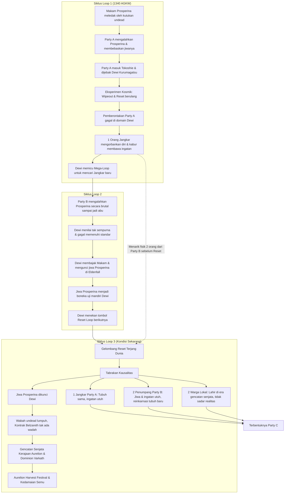

# ☀️ Lore Kerajaan Aurelion: Siklus Waktu & Kausalitas
*Benua Solmarch — Skenario Aurelion [REVISED]*

---

## 🌀 Bagan Alir Hubungan Siklus Loop

---

## 🕰️ Timeline Resmi (Kanon Baru)

*   **1300 AGKW — Puncak Kejayaan**
    Perang besar antara Kerajaan Aurelion dan Dominion Varkath terjadi. Aurelion berhasil memenangkan perang ini berkat kekuatan luar biasa dari Prosperina dan party pahlawannya.
*   **1310 AGKW — Pengkhianatan & Penulisan Ulang Sejarah**
    Varkath yang kalah secara militer berhasil menanamkan fitnah ke dalam Kerajaan Aurelion. Akibat paranoia raja, Prosperina dan seluruh partynya dieksekusi secara bersamaan. Kerajaan Aurelion kemudian mengubah sejarah, mencatat bahwa mereka gugur melawan musuh, dan menutup rapat-rapat fakta eksekusi ini di arsip rahasia.
*   **1312 AGKW — Kejatuhan Aurelion**
    Kehilangan pahlawan terkuat mereka, militer Aurelion melemah drastis. Dominion Varkath melihat celah ini dan langsung melancarkan invasi kedua.
*   **1320 AGKW — Kemenangan Varkath**
    Setelah delapan tahun peperangan yang melelahkan, Varkath memenangkan perang berkepanjangan ini. Dunia masuk ke era gencatan senjata dan damai bersyarat yang menekan Aurelion.
*   **7 Kythorn 1340 AGKW — Masa Kini (Dimulainya Campaign / Loop 3)**
    Tiga puluh tahun sejak eksekusi Prosperina. Aurelion Harvest Festival sedang digelar secara megah untuk merayakan "Tahun Kedamaian" di seluruh penjuru negeri. Di sinilah Party C terbentuk, menemukan buku arsip tua berumur 30 tahun yang usang di Brackenford, dan menyadari bahwa sejarah yang dirayakan hari ini adalah kebohongan.

---

## 📜 Detail Skenario Aurelion

### 🌀 Siklus Loop 1: Tragedi Party A, Pemberontakan, dan Motif Rahasia Dewi

Semuanya bermula di tahun **1340 AGKW** ketika makam pahlawan kuno Prosperina di Eldenfall meledak oleh kutukan *undead*. **Party A** maju menghadapi ancaman tersebut, mengalahkan Prosperina, dan berhasil membebaskan jiwanya dari kontrak iblis Belzareth.

Namun, begitu mereka melangkah keluar dari makam dan masuk ke Kerajaan Keabadian (Tokoshie), mereka dijebak oleh **Dewi Keabadian (Kurumagatsu)** untuk dijadikan subjek eksperimen kosmik dan baterai *"Jangkar"* waktu. **Jangkar** ini bertindak sebagai pembatas (*restriction*) bagi Dewi Keabadian; tanpa adanya Jangkar aktif sebagai tumpuan kausalitas, sang Dewi tidak akan memiliki kekuatan untuk memutar atau me-*looping* waktu. Di sana, mereka terkena *wipeout* (mati) dan di-*reset* terus-menerus dalam siklus pengejaran kesempurnaan absolut milik sang Dewi.

Sadar bahwa mereka hanya dijadikan komponen abadi, Party A melakukan pemberontakan. Namun, **pemberontakan tersebut gagal total** karena kekuatan Dewi terlalu perkasa di domainnya. Di ambang kehancuran total, Party A mengambil langkah nekat: mereka mengorbankan diri demi mengutus **1 orang untuk kabur menembus ruang-waktu** ke dunia luar membawa memori asli mereka.

Melihat hal ini, Dewi Keabadian menyadari bahwa kalkulasi kesempurnaannya telah cacat. Mengetahui si pelarian adalah **Jangkar terakhir** yang tersisa, sang Dewi sengaja **menggunakan esensi si Jangkar yang kabur ini sebagai pemantik paksa untuk melakukan *mega-loop***—menarik mundur seluruh garis waktu dunia luar jauh ke belakang ke titik sebelum pertarungan melawan Prosperina dimulai. 

> [!NOTE]
> **Motif Dewi:** Sang Dewi ingin memanfaatkan sisa eksistensi Jangkar A yang kabur untuk memutar waktu demi **mencari kandidat Jangkar baru** yang jauh lebih kuat dan sempurna di *loop* selanjutnya.

---

### ⚡ Siklus Loop 2: Kegagalan Party B & Pembajakan Makam

Di dalam realitas baru pasca *mega-loop*, dunia luar berjalan dengan takdir yang bergeser. Kali ini, giliran **Party B** yang tiba di makam Prosperina. Mereka berhasil menang, namun dengan cara yang brutal—langsung menghancurkan Prosperina menjadi abu tanpa pernah mencoba berdialog atau memastikan kematiannya secara tuntas. Bagi Dewi Keabadian yang perfeksionis, cara ini dinilai cacat dan gagal memenuhi standar kesempurnaan.

Namun, di momen rentan saat tubuh Prosperina hancur menjadi abu, Dewi Keabadian langsung mengintervensi dunia luar. Sang Dewi membajak makam tersebut, lalu **mengekang dan mengunci jiwa Prosperina tepat di dalam makamnya sendiri di Eldenfall**. 

Dewi mengubah fungsi jiwa Prosperina menjadi boneka penguji mandiri yang dikendalikan penuh oleh kesadaran sang Dewi sendiri, demi menyaring petualang baru (kandidat Jangkar) yang jauh lebih tangguh di *loop* berikutnya. Begitu proses penguncian jiwa selesai, Dewi Keabadian kembali menekan tombol *looping*.

---

### ⏳ Siklus Loop 3: Penarikan Jiwa Kosmik & Terciptanya Kedamaian Semu

Di sinilah momen krusial itu terjadi. Si Jangkar dari Party A yang berada di luar ruang-waktu **sudah merasakan bahwa riak anomali *looping* akan terjadi sekali lagi**. Sebelum kilatan *reset* realitas itu menghantam, dalam sepersekian detik kosmik, si Jangkar dengan cepat **meraih dan menarik fisik dua orang dari Party B** yang saat itu berada di dekatnya.

Ketika gelombang *looping* akhirnya menerjang dan menulis ulang realitas menjadi Siklus ke-3, terjadilah **Tabrakan Kausalitas**:

> [!IMPORTANT]
> **Dampak Tabrakan Kausalitas pada Karakter:**
> * **Si Jangkar (Party A):** Karena dia adalah Jangkar sah yang memicu *mega-loop* pertama, ruang dan waktu melindunginya. Dia terbangun dengan **tubuh yang sama dan ingatan yang utuh**.
> * **Dua Penumpang (Party B):** Karena mereka bukan Jangkar sah, hukum waktu menolak mereplikasi fisik mereka yang lama. Tubuh asli mereka terhapus oleh *reset*, namun karena jiwa mereka sempat "dipegang" oleh si Jangkar saat transisi, **jiwa dan ingatan lama mereka berhasil lolos dari penghapusan waktu**. Akibatnya, jiwa mereka terseret dan dipaksa **bereinkarnasi ke dalam tubuh baru yang sama sekali berbeda** di garis waktu yang baru ini.

Intervensi Dewi yang mengekang jiwa Prosperina di dalam makam pada *loop* sebelumnya membawa dampak *butterfly effect* yang masif ke dunia luar:

* 🛡️ **Lumpuhnya Kontrak Iblis:** Karena jiwa Prosperina telah disita dan dikunci oleh kekuatan Dewi Keabadian, kontrak iblis Belzareth kehilangan wadah utamanya di makam. Ledakan wabah *undead* yang seharusnya menghancurkan kota Eldenfall dan Graymere di tahun 1340 AGKW tidak pernah terjadi.
* 🤝 **Terciptanya Gencatan Senjata:** Tanpa adanya ancaman kosmik *undead* yang menguras logistik dan moral bangsa, konflik konvensional antara Kerajaan Aurelion dan Dominion Varkath mereda. Kedua kerajaan setuju untuk mengambil jalan **gencatan senjata (damai bersyarat)**.

Dunia luar tiba-tiba menjadi damai, dan Aurelion pun menggelar perayaan megah *Aurelion Harvest Festival*.

---

## 👥 Komposisi Anggota Party C (Siklus Saat Ini)

Di sinilah kelima orang ini akhirnya dipertemukan oleh takdir baru dalam **Party C**:

| No | Tipe Karakter | Deskripsi Asal & Kondisi Saat Ini |
|---|---|---|
| **1** | **1 Orang Jangkar (Party A)** | Memiliki tubuh yang sama, ingatan utuh tentang kegagalan pemberontakan di Tokoshie, dan memikul beban emosional sebagai pelarian. |
| **2** | **2 Penumpang Memori (Party B)** | Jiwa lama dengan ingatan tentang pertarungan brutal di makam, namun terbangun di dalam wadah/tubuh baru yang asing akibat reinkarnasi paksa. |
| **3** | **2 Warga Asli (Oblivious)** | Dua orang murni yang lahir dan hanya mengetahui kedamaian era gencatan senjata ini. Sama sekali tidak menyadari bahwa dunia indah tempat mereka berdiri sebenarnya adalah sangkar emas yang sedang menunggu giliran untuk di-*reset* kembali oleh sang Dewi. |

---

# 🏰 Skenario Highspire: Sangkar Emas

## 🌟 Kondisi Awal
Highspire, kota besar pusat administratif Kerajaan Aurelion, sedang merayakan **Aurelion Harvest Festival**. Pesta ini adalah perayaan "Tahun Kedamaian" antara Aurelion dan Varkath. Suasana sangat meriah, bendera kedua faksi berkibar, musik mengalun, tapi bagi yang peka, kedamaian ini terasa terlalu dipaksakan.

---

## 🎬 Alur Scene Highspire

### 📍 Scene 1: Cermin Pantulan Jiwa (Pertemuan Party A & B)
* **Lokasi:** Wahana Ilusi *The Pavilion of Reflections* di pojok festival.
* **Kejadian:** 2 karakter Penumpang (Party B) masuk ke wahana cermin. Alih-alih memantulkan tubuh baru mereka, cermin itu memantulkan wujud tubuh asli mereka yang mati di Loop 2. Mereka panik.
* **Pertemuan:** Si Jangkar (Party A) yang sedang melacak anomali melihat reaksi mereka. Sadar bahwa ini adalah jiwa-jiwa yang ia tarik saat reset terjadi, Si Jangkar menarik mereka ke gang sepi. Di sinilah mereka bertukar informasi dan menyadari bahwa realitas telah ditulis ulang oleh sang Dewi.

### ⚔️ Scene 2: Tabrakan Kausalitas (Battle & Penyatuan Party C)
* **Lokasi:** Alun-Alun Utama, Puncak Parade Festival.
* **Kejadian:** 2 karakter Oblivious (warga asli) sedang menikmati parade kereta hias (*float*) raksasa yang melambangkan perdamaian. Tiba-tiba, terjadi *glitch* (Tabrakan Kausalitas). Kereta hias itu terdistorsi dan memunculkan monster Phantom/Specter masa lalu dari perang yang seharusnya sudah dihapus dari sejarah ini.
* **Pertempuran:** Ledakan energi dari *glitch* melempar warga biasa, tapi Party A dan B yang punya resonansi waktu kebal dari efeknya. Mereka melompat masuk untuk membantu 2 karakter Oblivious yang kebetulan terjebak di area bahaya. Kelimanya bertarung bersama menghalau bayangan masa lalu tersebut.

### 🔒 Scene 3: Lockdown Keamanan & Kompas Kosmik (The Hook)
* **Intervensi Otoritas:** Setelah monster hancur, Penjaga Kota dan Guild Master Corvin Hale segera tiba. Corvin yang sangat peduli pada stabilitas politik segera menutupi insiden tersebut dari publik, menyebutnya sebagai *"Sabotase kembang api oleh kelompok pemberontak"*.
* **Perintah Lockdown:** Sebagai dalih keamanan, Corvin Hale memerintahkan seluruh gerbang kota ditutup sementara dan semua operasional kereta kuda/transportasi dihentikan total sampai besok pagi. Party C kini terjebak di Highspire.
* **The Hook (Motivasi):** Saat Phantom tadi mati, ia meninggalkan sebuah **Artefak Jarum Kompas Kosmik**. Saat dipegang oleh kelima karakter, jarum itu bergetar hebat menunjuk tegak lurus ke arah utara (Makam Prosperina di Eldenfall). Saat menyentuhnya, 2 karakter Oblivious mendapat *vision* mengerikan tentang langit ungu, kiamat, dan Eldenfall yang hancur, membuat mereka sadar kedamaian kota ini adalah ilusi.

---

## 🔍 Scene 4: Free Roam Festival (Investigasi Tersembunyi)
Karena kereta kuda baru akan beroperasi besok pagi, Party C kini punya waktu untuk melakukan *free roam* di sekitar area festival yang masih berjalan namun dijaga lebih ketat.

Pemain bisa mengeksplorasi lokasi/NPC berikut untuk menemukan jejak kebohongan sejarah:

1. 📚 **Arsip Sejarah Festival (The Grand Pavilion of Peace):**
   Jika pemain memeriksa buku-buku sejarah kebanggaan kota yang dipamerkan, mereka akan menyadari sebuah kejanggalan fisik: tinta dan cat pada halaman yang menceritakan "Tahun Kedamaian" masih basah. Seolah-olah sejarah berabad-abad itu baru saja dicetak ulang beberapa hari yang lalu saat reset kosmik terjadi.
2. 🎨 **Mural di Gang Tua:**
   Ada mural besar pahlawan yang cat barunya mulai mengelupas. Jika pemain mengoreknya, lapisan bawahnya menunjukkan gambar asli: Prosperina dirantai oleh pasukan Aurelion, bukan dihormati.
3. 🔮 **Tenda Peramal (Madam Vespera):**
   Pemain bisa iseng diramal. Madam Vespera akan menarik kartu yang kosong, lalu menatap party dengan ngeri: *"Benang nasib kalian... tidak berhulu. Seseorang telah memotong kain waktu dengan sangat kasar."*
4. 🏮 **Pasar Gelap Lampion:**
   Pemain bisa mencari info atau membeli perlengkapan dari pedagang gelap yang berbisik bahwa penjaga kota sedang panik menyembunyikan laporan anomali di berbagai wilayah, bukan cuma di festival.

---

# 🎬 SCENE SESI 1 — HIGHSPIRE: SANGKAR EMAS
**Fokus Utama Sesi:** *Worldbuilding* kedamaian semu, pembentukan Party C, penyampaian misteri kosmik, dan *lockdown* kota.

### 📍 Scene I: Cermin Pantulan Jiwa
* **Lokasi:** Wahana Ilusi *The Pavilion of Reflections*, pojok area festival.
* **Fokus:** Pertemuan Party A & B, *Lore drop* awal, *Roleplay* (RP).
* **Tensi:** Rendah $\rightarrow$ Panik.
* **Kejadian:**
  * 2 karakter Penumpang (Party B) masuk ke wahana cermin. Cermin tidak memantulkan tubuh baru mereka, melainkan wujud asli mereka yang mati di Makam Prosperina pada *Loop 2*.
  * Mereka panik dan mengalami disonansi kognitif.
  * Si Jangkar (Party A) yang sedang menginvestigasi anomali melihat mereka, menyadari resonansi jiwa yang ia tarik saat *reset* kosmik, lalu menarik mereka ke gang sepi.
  * Pertukaran informasi rahasia terjadi: ingatan masa lalu, *looping* waktu, dan manipulasi Sang Dewi.
* **Output Scene:** Party A dan B menyadari mereka berada di realitas yang ditimpa ulang.

### ⚔️ Scene II: Tabrakan Kausalitas (Battle I)
* **Lokasi:** Alun-Alun Puncak Parade Festival Highspire.
* **Fokus:** Penyatuan penuh Party C, Ancaman nyata, Validasi bahaya.
* **Tensi:** Tinggi.
* **Monster:** 2-3 *Phantom/Specter Echoes* (bisa menggunakan *statblock Specter* dengan *flavor* prajurit Aurelion/Varkath masa lalu).
* **Kejadian:**
  * 2 karakter *Oblivious* sedang menikmati parade kereta hias "Perdamaian".
  * Tiba-tiba terjadi *glitch* kosmik (Tabrakan Kausalitas). Kereta hias terdistorsi, memunculkan hantu-hantu prajurit dari masa perang.
  * Ledakan energi statis melempar warga biasa. Party A & B (kebal efek *glitch* karena resonansi waktu) langsung melompat membantu 2 karakter *Oblivious* yang terjebak di tengah bahaya.
  * Pertempuran pecah di tengah kepanikan festival.
* **Output Scene:** Kelima karakter bertarung bersama dan resmi terikat oleh insiden anomali yang sama.

### 🔒 Scene III: Lockdown & The Hook
* **Lokasi:** Alun-Alun (Pasca-pertarungan).
* **Fokus:** Konsekuensi politik, *Hook* perjalanan ke Eldenfall.
* **Tensi:** Sedang (Interogasi halus).
* **Kejadian:**
  * Penjaga kota dan Guild Master **Corvin Hale** tiba. Corvin yang selalu loyal pada stabilitas dan menghindari diskusi kebenaran, segera menyapu bersih bukti dan menyebutnya sebagai "Sabotase kembang api kelompok pemberontak".
  * Corvin memerintahkan *Lockdown* gerbang kota dan menghentikan seluruh operasional kereta kuda/transportasi hingga besok pagi.
  * **The Hook:** Saat monster *Specter* hancur, ia menjatuhkan **Artefak Jarum Kompas Kosmik**.
  * Saat dipegang oleh kelima PC, kompas bergetar menunjuk ke arah utara (Makam Prosperina di Eldenfall). Karakter *Oblivious* yang menyentuhnya mendapat *vision* kilat: langit ungu, kiamat, dan Eldenfall yang hancur.
* **Output Scene:** Party C terjebak *lockdown*, namun kini punya motivasi personal yang kuat untuk pergi ke makam setelah menyadari kedamaian kota ini adalah ilusi.

### 🔍 Scene IV: Free Roam (Investigasi Tersembunyi)
* **Lokasi:** Berbagai titik di Highspire yang dikarantina.
* **Fokus:** Eksplorasi, *Puzzle* sejarah, *Lore drop* opsional.
* **Tensi:** Investigatif & Misteri.
* **Pilihan Eksplorasi PC (Bisa dibagi-bagi):**
  * **Arsip Sejarah (The Grand Pavilion of Peace):** Buku sejarah kerajaan ditulis sangat rapi, namun pemain yang lulus *check Investigation* menyadari tinta dan cat pada halaman "Tahun Kedamaian" **masih basah**, seolah baru ditulis beberapa hari lalu.
  * **Mural di Gang Tua:** Mural pahlawan yang cat barunya mengelupas. Jika dikorek, terlihat gambar asli: Prosperina dirantai oleh pasukan Aurelion.
  * **Tenda Madam Vespera:** Peramal menarik kartu tarot kosong untuk Party C. Ia ketakutan dan berbisik: *"Benang nasib kalian... terpotong dan diikat ulang dengan kasar."*
  * **Pasar Gelap Lampion:** Pedagang berbisik soal kepanikan penjaga kota menyembunyikan anomali.
* **Output Scene:** Kesimpulan kuat bahwa pemerintah secara aktif menutupi realitas yang terdistorsi. Party C sepakat menyewa kereta ke utara (Brackenford) besok pagi.

---

# 📍 POINTER SESI 1 (HIGHSPIRE)

### 🏙 Kota & Lokasi Penting
* **Highspire:** Kota administratif penuh simbol kerajaan, sejarahnya ditulis rapi secara politis. Fasad dari kedamaian semu (Loop 3).
* **The Pavilion of Reflections:** Wahana cermin festival tempat jiwa reinkarnasi Party B menyadari tubuh baru mereka.
* **The Grand Pavilion of Peace:** Tenda arsip/pameran tempat bukti bahwa sejarah baru saja "ditulis ulang" ditemukan (tinta basah).

### 👥 NPC Penting di Highspire
**1. Guild Master Corvin Hale**
* **Lokasi:** Guild Highspire / Alun-alun pasca insiden.
* **Kepribadian:** Sangat profesional, dingin, peduli pada stabilitas daripada kebenaran.
* **Fungsi:** Menginisiasi *lockdown* dan menekan PC agar tidak membuat masalah, menjadi representasi birokrasi Aurelion yang buta.
* **Kalimat Khas:** *"Kerajaan tidak butuh pahlawan baru untuk festival ini. Nikmati saja pestanya, atau pergi dari kotaku."*

**2. Madam Vespera (NPC Opsional)**
* **Lokasi:** Tenda peramal di area festival.
* **Kepribadian:** Eksentrik namun peka terhadap energi kosmik.
* **Fungsi:** Memberikan validasi spiritual bahwa PC adalah anomali ruang-waktu.

### 🧭 Item Kunci (The Hook)
**Jarum Kompas Kosmik**
* **Wujud:** Debu bercahaya sisa anomali yang memadat menjadi jarum emas/ungu.
* **Sifat:** Mengabaikan kutub utara asli, jarumnya beresonansi dengan energi Kurumagatsu dan selalu menunjuk ke Makam Eldenfall.
* **Efek Psikologis:** Memberikan *vision* memori kehancuran kepada entitas asli (karakter *Oblivious*), menghancurkan rasa aman mereka terhadap realitas *Loop 3*.

---

# 🏰 Skenario Brackenford: Api yang Membeku

## 🌟 Kondisi Awal
Perjalanan kereta kuda membawa kalian menjauh dari kemegahan Highspire, memasuki wilayah yang dulunya merupakan garis depan perang berdarah melawan Varkath. Kalian tiba di **Brackenford**, sebuah desa agraris yang kini dipenuhi oleh veteran perang dan dijaga ketat oleh patroli militer. Di sini, Aurelion Harvest Festival juga dirayakan, namun suasananya terasa sangat kaku. Lampion-lampion pesta digantung secara asal di atas sisa-sisa barikade kayu lama, dan tawa para warga terdengar dipaksakan untuk menutupi kecemasan yang menggantung di udara.

---

## 🎬 Alur Cerita Brackenford (Naratif)

### 📍 Fase I: Monumen Perang & Resonansi Dingin
Di tengah alun-alun desa, tidak ada parade, melainkan sebuah monumen batu yang sunyi: *The Prosperina War Memorial*. Sebagai tradisi festival kedamaian, "Api Abadi" seharusnya dinyalakan di bawah patung sang pahlawan. Namun, anehnya, setiap kali api disulut, nyalanya langsung mati tersedot oleh udara dingin yang tidak wajar. Kurator Elayne, sang penjaga monumen, berdiri di sana dengan wajah frustrasi sambil mengusap lengan yang merinding.
*"Batu perapian ini memiliki resonansi dengan esensi pahlawan kita,"* gumam Elayne pelan saat kalian mendekat. *"Seharusnya batu ini memancarkan kehangatan... Tapi sekarang sedingin es, seolah sumber magisnya di Eldenfall sedang dikunci paksa, tertahan di dalam ruang hampa."*

### 🔒 Fase II: Karantina & Paranoia Jorren Feld
Kejanggalan tidak berhenti di sana. Gerbang utara yang mengarah ke Old Battlefield dan Graymere ditutup rapat dengan barikade tebal. Perintah karantina itu datang dari kediaman terbesar di desa, milik Magistrate **Jorren Feld**—seorang mantan Perwira Intelijen Aurelion yang kini menjadi kepala wilayah yang sangat paranoid. Ia mengurung diri di rumahnya dengan pengamanan berlapis, menolak merayakan festival dengan dalih "latihan militer rahasia".

### 🤫 Fase III: Penyusupan Malam & Ruang Arsip
Merasa ada yang disembunyikan oleh sang Magistrate di balik karantina ini, kalian memutuskan untuk menyusup ke dalam kediamannya saat malam turun. Melewati penjagaan yang lengah karena arak festival, kalian menembus masuk ke dalam Ruang Arsip Pribadi Jorren. Di tengah tumpukan peta militer dan laporan logistik, sebuah buku besar militer tua (**The Old Ledger**) dari masa akhir perang tahun 1310 AGKW tergeletak di atas meja.

### 📜 Fase IV: Rahasia Hitam "The Old Ledger"
Lembaran kertasnya tebal, rapuh, dan berdebu. Di luar sana, seluruh warga merayakan Prosperina sebagai martir agung yang gugur di ujung pedang Varkath. Namun, saat kalian membalik halamannya menuju catatan tentang sang pahlawan, kalian menemukan keagungan legenda itu direnggut paksa.
Di bawah nama Prosperina, status kematiannya tidak mencatat heroisme apa pun. Sebaliknya, tinta hitam usang yang telah mengering selama tiga puluh tahun mencatat sebuah kebenaran administratif yang dingin:
**"Dieksekusi oleh Titah Raja — Dituduh Berkhianat."**

Sejarah agung yang dirayakan di bawah lampion festival itu hanyalah kebohongan yang diwariskan. Pahlawan mereka tidak dibunuh oleh musuh, melainkan dikhianati oleh kerajaannya sendiri.
Dengan bukti kebohongan masa lalu yang kini ada di tangan, serta kunci izin untuk melewati palang militer, kalian meninggalkan cahaya lampion Brackenford di belakang. Kalian melangkah menembus gerbang utara, masuk ke dalam pelukan kabut tebal dan dingin dari **Old Battlefield**, tempat di mana gema dari masa lalu yang terhapus sedang menunggu untuk bangkit.

---

# 🎬 SCENE SESI 1 — BRACKENFORD: GEMA DI BALIK PESTA
**Fokus Utama Sesi:** Memperlihatkan bahwa "Kedamaian Festival" ini hanyalah topeng, mengungkap kebohongan sejarah Kerajaan Aurelion secara logis lewat arsip tua, dan transisi ke area bahaya.

### 📍 SCENE I — MONUMEN YANG MEMBEKU (EVENT & FORESHADOWING)
* **Lokasi:** *The Prosperina War Memorial* (Tengah desa).
* **Fokus:** Anomali magis, Foreshadowing nasib Prosperina.
* **Tensi:** Misteri.
* **Kejadian:**
  * Warga mencoba menyalakan "Api Abadi" di bawah patung Prosperina sebagai bagian dari perayaan festival, tapi apinya selalu mati tersedot udara dingin.
  * Kurator Elayne yang menjaga monumen terlihat kebingungan dan memberi tahu Party C: *"Batu perapian ini memiliki resonansi dengan esensi sang pahlawan. Harusnya hangat... Tapi sekarang sedingin es, seolah sumber magisnya di Eldenfall sedang dikunci paksa di ruang hampa."*
* **Output Scene:** Petunjuk awal (secara magis) bahwa jiwa Prosperina tidak beristirahat dengan tenang, melainkan sedang dikurung oleh kekuatan kosmik (sang Dewi).

### ⚔️ SCENE II — KARANTINA INFORMASI & FREE ROAM
* **Lokasi:** Berbagai area festival di Brackenford.
* **Fokus:** Eksplorasi, interaksi dengan veteran perang yang trauma, mencari akses ke utara.
* **Tensi:** Investigasi.
* **Kejadian (Pilihan Free Roam):**
  * **Pos Gerbang Utara:** Party melihat jalan ke utara (Old Battlefield/Graymere) diblokir total oleh militer. Kapten Darion menolak siapa pun lewat dengan alasan *"Latihan Militer Rahasia"*.
  * **Kedai "The Broken Shield":** Party C bisa berinteraksi dengan Old Silas (Veteran Buta). Silas mengalami resonansi loop dan menunjuk ke karakter Penumpang (Party B): *"Suaramu baru... tapi langkah kakimu adalah langkah orang mati. Aku melihatmu hancur di makam itu."*
  * **Pasar Festival Darurat:** Party bertemu Lia (Pedagang Varkath) yang membocorkan bahwa komando utara sebenarnya sedang panik, dan Gencatan Senjata ini murni karena kedua pihak ketakutan setengah mati pada apa yang ada di Eldenfall saat ini.
* **Output Scene:** Party C menyadari mereka harus menembus gerbang utara, dan kunci izinnya ada di kediaman sang Kepala Wilayah.

### 📜 SCENE III — LORE DROP: DISONANSI SEJARAH (INVESTIGASI)
* **Lokasi:** Ruang Arsip Pribadi di kediaman Magistrate Jorren Feld.
* **Fokus:** Mengungkap fakta pengkhianatan Aurelion tanpa plot hole (tanpa tinta basah).
* **Tensi:** Stealth / Menegangkan.
* **Kejadian:**
  * Party C menyelinap masuk ke ruang arsip saat Jorren sibuk di perayaan festival.
  * **The Lore Drop:** Mereka menemukan sebuah buku besar militer tua (The Old Ledger) dari tahun 1310 AGKW. Sepanjang festival, orang-orang merayakan dongeng bahwa Prosperina adalah martir yang *"gugur dengan gagah berani melawan Varkath"*. Namun di dalam buku usang itu, status kematian Prosperina dan partynya dicatat dengan tinta lama yang sudah memudar: *"Dieksekusi oleh Titah Raja — Dituduh Berkhianat."*
* **Output Scene:** Party C mendapatkan bukti absolut bahwa Kerajaan Aurelion mengkhianati pahlawannya sendiri, dan sejarah agung di luar sana murni propaganda.

### 🌁 SCENE IV — MENEMBUS KABUT (TRANSISI)
* **Lokasi:** Gerbang Utara Brackenford.
* **Fokus:** Meninggalkan zona aman.
* **Tensi:** Meningkat.
* **Kejadian:**
  * Dengan kunci/surat izin yang dicuri dari arsip Jorren (atau hasil memeras informasi), Party C berhasil membuka palang barikade gerbang utara.
  * Mereka meninggalkan gemerlap lampion festival di belakang, dan melangkah masuk ke dalam kabut tebal Old Battlefield.
* **Output Scene:** Party C resmi memulai perjalanan menuju titik bahaya anomali kosmik.

---

# 📍 POINTER SESI 1 (BRACKENFORD)

### 🏚️ STRUKTUR & BANGUNAN PENTING
* **The Prosperina War Memorial:** Bukan kuil, melainkan monumen sejarah. Tempat api abadi menolak menyala akibat jiwa Prosperina yang dikunci oleh sang Dewi di makam.
* **Magistrate's Estate:** Kediaman mewah dengan penjagaan ketat. Menyimpan arsip perang asli yang tidak pernah dipublikasikan.
* **Kedai "The Broken Shield":** Tempat para veteran berkumpul. Fasadnya dihias lampion festival, tapi isinya penuh orang trauma yang mengalami *"mimpi kolektif"* dari sisa ingatan Loop 2.
* **Pos Gerbang Utara:** Titik karantina militer yang menghalangi jalan menuju Old Battlefield.

### 👥 NPC PENTING DI BRACKENFORD
**1. Kurator Elayne**
* **Fungsi:** Penjaga warisan sejarah lokal. Memberi validasi bahwa secara magis, ada anomali yang terjadi pada sisa esensi Prosperina.

**2. Magistrate Jorren Feld**
* **Fungsi:** Mantan Perwira Intelijen yang paranoid. Menyimpan The Old Ledger. Dia memblokir gerbang utara demi menutupi kepanikan militer di Graymere.

**3. Old Silas (Veteran Buta) - Opsional**
* **Fungsi:** Pemicu ketegangan psikologis. Peka terhadap anomali waktu dan bisa memicu glitch kognitif bagi Party B (sadar bahwa mereka memakai wadah/tubuh yang *"salah"*).

**4. Lia (Pedagang Varkath) - Opsional**
* **Fungsi:** Menyampaikan lore politik bahwa baik Varkath maupun Aurelion saat ini sama-sama buta dan ketakutan terhadap apa yang sebenarnya terjadi di makam.

### 📜 LORE DROP KUNCI
**Buku Besar Militer (The Old Ledger)**
* **Kategori:** Buku sejarah usang dari tahun 1310 AGKW.
* **Isi Kunci:** Menunjukkan kontradiksi ekstrem. Publik dicekoki propaganda bahwa Prosperina gugur melawan musuh, padahal arsip asli mencatat dia *"Dieksekusi oleh Titah Raja."*
* **Makna Naratif:** Membuktikan Kerajaan Aurelion adalah pembohong, membuat Party C kehilangan rasa percaya pada otoritas.

**Surat Izin Karantina**
* **Wujud:** Gulungan kertas bertanda tangan Magistrate Jorren Feld.
* **Fungsi:** Kunci otorisasi untuk membuka barikade militer di gerbang utara.

---

# 🎬 Skenario Old Battlefield: Gema yang Tersangkut

## 🌟 Kondisi Awal
Meninggalkan gemerlap lampion dan wajah-wajah kaku penduduk Brackenford, kalian melangkah masuk ke batas Old Battlefield. Tanggal 9 Kythorn terasa jauh lebih dingin di wilayah tanpa tuan ini. Tidak ada alunan musik festival, tidak ada pita warna-warni—hanya hamparan tanah tandus abu-abu yang diselimuti kabut tebal yang tidak mengikuti arah angin.

---

## 🎬 Alur Cerita Old Battlefield (Naratif)

### 📍 Fase I: Pos Jaga Kosong & Logbook Paranoid
Di awal perjalanan, kalian melewati Menara Pengawas Gencatan Senjata milik militer Aurelion yang kosong melompong. Api obornya masih menyala, namun pos itu ditinggalkan terburu-buru. Di atas meja jaga, kalian menemukan sebuah buku log dengan tulisan tangan yang panik: 
*"Kabut ini tidak wajar. Kami terus melihat teman-teman kami yang tewas bertahun-tahun lalu berjalan di dalamnya, mengulangi hari kematian mereka secara berulang. Komando pusat menyuruh kami diam demi festival."*

### 🔒 Fase II: Kael si Pemulung & Peringatan Distorsi
Tak jauh dari sana, di dekat puing-puing kereta logistik, kalian memergoki Kael—seorang pemulung nekat yang memungut zirah berkarat. Wajahnya pucat pasi saat melihat kalian melintas. 
*"Jangan masuk ke parit utama,"* bisiknya dengan bibir bergetar. *"Orang-orang mati di sana tidak bangkit seperti zombie biasa. Mereka seperti bayangan yang tersangkut. Waktu di tempat ini sudah rusak!"*

### 🔮 Fase III: Pohon Raksasa Kosmik & Tiga Teka-teki
Kalian mengabaikan peringatannya dan terus menembus kabut. Tiba-tiba, tanah bergetar hebat. Dari bawah lapisan abu, akar-akar kayu hitam menjebol permukaan tanah secara instan, merajut diri ke atas hingga membentuk sebuah Pohon Raksasa yang sepenuhnya tidak wajar. Daunnya berwarna emas, sementara getahnya memancarkan pendar ungu kosmik. Akar pohon itu memblokir seluruh jalur, dan dari lekukan kulit kayunya, terbentuk sebuah wajah tua tak bermata. Suaranya menggema langsung di dalam kepala kalian.
*"Sebuah anomali berjalan di atas tanah yang dipaksa damai... Aku tidak akan membiarkan benang waktu yang kusut ini lewat, kecuali kalian menjawab tiga tanyaku."*

Pohon itu terkekeh pelan. 
*"Pertama... ceritakan padaku, apa pengalaman paling memalukan yang pernah kalian alami di sisa hidup fana kalian?"*
Setelah mendengar jawaban kalian, nada pohon itu berubah menjadi kasual dan absurd: 
*"Kedua... menurut mata fana kalian, ciptaan manakah yang lebih rupawan: manusia kucing Tabaxi, atau manusia rubah Kitsune?"*

Namun, begitu pertanyaan kedua dijawab, angin mendadak mati. Suasana berubah sangat eerie. Wajah kayu itu mencondongkan tubuhnya ke depan, seolah mengendus aroma jiwa kalian.
*"Dan yang ketiga..."* bisiknya dengan suara ganda yang menggetarkan dada. *"Apakah ini kali pertama kalian berada di tempat ini? ...Sudah berapa kali kalian mengalami tanggal 9 Kythorn?"*

*(Di titik ini, jika Si Jangkar dan Penumpang / Party A & B menjawab jujur dengan menyadari adanya loop)*: Wajah di pohon itu tersenyum lebar hingga kayunya retak. 
*"Ah... jiwa-jiwa yang menolak dihapus. Hadiah untuk kejujuran kalian adalah sebuah kepastian: Pahlawan api yang kalian tuju di Eldenfall tidak mati oleh iblis. Sang Cahaya telah membajak makamnya. Makam itu kini bukan lagi tempat istirahat, melainkan sebuah 'mesin saringan'. Sang Dewi terus mereset waktu, mencari jiwa-jiwa yang pantas. Jika kalian mengingat hari ini... itu berarti kalian sedang diuji untuk menjadi penggantinya."*

Akar pohon itu perlahan melonggar, lalu hancur menjadi debu emas kosmik yang terbawa angin, membiarkan kalian lewat.

### ⚔️ Fase IV: Parit Perang Tua & Gema Kerangka
Kalian akhirnya melangkah masuk ke area Parit Perang Tua (*The Old Trenches*). Keheningan dipecahkan oleh suara tulang yang bergesekan dengan zirah besi. Dari dalam lumpur kering, prajurit-prajurit lama bangkit. Namun yang membuat darah kalian berdesir adalah mereka mengenakan zirah Aurelion dan Varkath yang tercampur. Musuh bebuyutan di masa lalu, yang kini bangkit berdampingan secara tidak wajar, digerakkan oleh satu entitas kosmik yang sama.

Setelah pertarungan sengit menghalau gema masa lalu tersebut, kalian memeriksa sisa kerangka yang hancur. Di sana, kalian menemukan sebuah liontin perwira militer Kerajaan Aurelion—dan secara mengejutkan, karakter Penumpang (Party B) menemukan pedang/senjata spesifik dari tubuh asli mereka yang tertancap di tanah ini. Sebuah validasi mutlak bahwa tubuh lama mereka pernah hancur di putaran waktu sebelumnya.
Kabut akhirnya menipis di ujung parit. Jalan setapak kini terbuka lurus, mengarah ke kota Graymere yang berada tidak jauh dari Eldenfall.

### 🎭 Fase V: Kontras Fasad: Festival Graymere
Setelah rentetan kengerian kosmik dan bayangan kematian di Old Battlefield, kalian bersiap menghadapi kota militer yang tegang. Namun, pemandangan di horizon sama sekali memutarbalikkan ekspektasi kalian.
Graymere tidak membisu, apalagi dipenuhi ketegangan. Dari kejauhan, langit malam kota itu berpendar hangat oleh ribuan cahaya lampion. Sayup-sayup, alunan musik yang ceria, suara denting gelas, dan tawa bersahutan menyambut kedatangan kalian. Warga dan para pendatang tumpah ruah di jalanan, merayakan Aurelion Harvest Festival dengan penuh kedamaian. 

Bau daging panggang dan arak manis menggantikan bau anyir darah. Di Graymere, dunia seolah menolak mengakui bahwa ada kiamat yang sedang menunggu di makam tepat di sebelah kota mereka. Fasad sangkar emas ini berdiri kokoh, menutupi kebenaran dengan pesta pora.

---

# 🎬 SCENE SESI 1 — OLD BATTLEFIELD: GEMA YANG TERSANGKUT
**Fokus Utama Sesi:** *Atmosphere building* (horor/misteri), mengungkap intervensi Dewi Kurumagatsu secara langsung lewat *roleplay*, dan *battle* melawan anomali waktu.

### 📍 SCENE I — ZONA DEMILITERISASI & SANG PEMULUNG
* **Lokasi:** Perbatasan masuk *Old Battlefield*, berselimut kabut tebal pada 9 Kythorn.
* **Fokus:** Eksplorasi awal, *foreshadowing* mekanik musuh.
* **Tensi:** Sepi $\rightarrow$ Mencekam.
* **Kejadian:**
  * Party C menemukan **Menara Pengawas Gencatan Senjata** milik Aurelion yang kosong melompong. Obor masih menyala, tapi penjaga kabur.
  * Di bawah menara, dekat gerobak hancur, mereka bertemu **Kael the Scavenger** yang sedang ketakutan memulung senjata.
  * Kael memperingatkan Party agar tidak masuk ke parit utama karena *"mayat di sana bukan zombie biasa, tapi bayangan yang tersangkut dan rusak waktunya."*
* **Output Scene:** Party tahu ancaman di depan adalah *glitch* ruang-waktu, dan militer secara sadar menutupi fakta ini.

### 🗣️ SCENE II — AKAR KOSMIK & TIGA PERTANYAAN (EVENT)
* **Lokasi:** Jalan setapak di tengah kabut.
* **Fokus:** *Roleplay*, *Lore Drop* masif tentang Dewi dan Makam.
* **Tensi:** Absurd $\rightarrow$ Tegang/Spiritual.
* **Kejadian:**
  * Tanah bergetar, **Pohon Raksasa Kosmik** dengan getah ungu (Aura Kurumagatsu) menembus tanah dan memblokir jalan.
  * Pohon menanyakan 3 pertanyaan. Pertanyaan 1 (Memalukan) untuk tes ego pemain. Pertanyaan 2 (Tabaxi/Kitsune) untuk memecah ketegangan/absurditas. 
  * Pertanyaan 3 (Inti): *"Apakah ini kali pertama kalian berada di sini? Sudah berapa kali kalian mengalami 9 Kythorn?"*
  * **Jika dijawab jujur (sadar Loop):** Pohon tersenyum dan memberikan *Lore Drop* besar (jiwa Prosperina dikunci sebagai saringan Jangkar oleh Dewi).
  * **Jika bohong/tidak tahu:** Pohon meratapi mereka sebagai bidak yang berjalan ke rumah jagal.
  * Pohon hancur menjadi debu emas kosmik, membuka jalan.
* **Output Scene:** Konfirmasi verbal pertama bahwa musuh sejati mereka adalah entitas kosmik/surgawi (Dewi), bukan sekadar konspirasi kerajaan.

### ⚔️ SCENE III — BATTLE: GEMA YANG TERKENDALI
* **Lokasi:** Parit Perang Tua (*The Old Trenches*).
* **Fokus:** Combat, validasi fisik dari *Loop* masa lalu.
* **Tensi:** COMBAT.
* **Monster:** Skeleton/Specter berbaju besi Aurelion & Varkath.
* **Kejadian:**
  * Tulang-belulang dan bayangan prajurit bangkit. Yang mengerikan, prajurit Aurelion dan Varkath (musuh bebuyutan) bangkit secara bersamaan dan bertarung di kubu yang sama.
  * Gerakan mereka terarah, seolah dikendalikan oleh satu "Sutradara" (efek intervensi Dewi).
  * Setelah menang, Party C bisa mengeksplorasi sisa-sisa medan tempur untuk mendapatkan item kunci.
* **Output Scene:** Pertempuran sukses, kabut menipis, dan Party menemukan validasi dari senjata lama mereka.

### 🎭 SCENE IV — TRANSISI: FASAD KEDAMAIAN
* **Lokasi:** Ujung *Old Battlefield*, memandang horizon ke arah Graymere.
* **Fokus:** Transisi *mood* yang kontras.
* **Tensi:** Mereda $\rightarrow$ Ironis.
* **Kejadian:**
  * Kabut habis. Di depan mereka berdiri kota karantina **Graymere**.
  * Alih-alih kota yang tegang, Graymere terang benderang oleh lampion. Musik festival dan bau daging panggang tercium. Kota ini sedang merayakan *Aurelion Harvest Festival*, menolak realitas kiamat yang ada di ujung hidung mereka.
* **Output Scene:** Sesi perjalanan selesai, Party C bersiap melakukan infiltrasi ke dalam festival karantina Graymere di sesi berikutnya.

---

# 📍 POINTER SESI 1 (OLD BATTLEFIELD)

### 🏚️ BANGUNAN & LOKASI UNTUK DIEKSPLOR
**1. Menara Pengawas Gencatan Senjata (Aurelion Watchtower)**
* *Pos militer yang baru ditinggalkan. Tempat pemain bisa melakukan Investigation/Perception untuk menemukan Logbook.*
**2. Parit Perang Tua (The Old Trenches)**
* *Jalur berlumpur kering penuh tulang dan zirah berkarat. Menjadi arena utama untuk Battle dan pencarian Loot spesifik (Senjata Reinkarnasi).*

### 👥 NPC PENTING
**1. Kael the Scavenger**
* **Fungsi:** *Merchant* darurat (jual-beli suplai dasar) dan pemberi peringatan mekanis bahwa monster di parit bukanlah *undead* biasa.
**2. Pohon Raksasa Kosmik (Manifestasi Kurumagatsu/Sistem)**
* **Fungsi:** NPC Event/Puzzle. Entitas netral yang menjadi corong sistem *looping*. Penguji kesadaran Party terhadap anomali waktu.

### 📜 LORE DROP & PENJELASAN ITEM
**1. Logbook Patroli Penjaga (Ditemukan di Menara)**
* **Isi:** Tulisan panik prajurit yang melihat teman mereka yang sudah mati 20 tahun lalu mengulang kematiannya di dalam kabut.
* **Penjelasan Lore:** Membuktikan bahwa petinggi militer Aurelion (Komando Pusat) sebenarnya **tahu** wilayah ini rusak waktunya, tapi menyuruh prajurit tutup mulut demi menjaga narasi "Tahun Kedamaian Festival".

**2. Lore Drop dari Pohon Kosmik (Jika PC Jujur tentang Loop)**
* **Isi Lore:** *"Prosperina tidak mati oleh iblis. Sang Cahaya (Dewi) telah membajak makamnya. Makam itu kini adalah mesin saringan. Jika kalian mengingat hari ini, kalian sedang diuji untuk menjadi penggantinya (Jangkar)."*
* **Penjelasan Lore:** Ini adalah pengungkapan plot terbesar di awal game. Pemain langsung tahu bahwa kiamat *undead* tidak terjadi karena jiwa Prosperina sedang dipakai sebagai boneka uji coba (fasilitas *stress test*) oleh sang Dewi.

**3. Liontin Perwira Aurelion & Zirah Campuran (Di Parit Perang)**
* **Isi/Bentuk:** Liontin perwira dengan tinta yang masih mengilap, ditemukan pada mayat yang menggunakan zirah campuran (Varkath & Aurelion).
* **Penjelasan Lore:** Membuktikan bahwa kebangkitan monster ini **bukanlah fenomena alam/necromancy biasa**. Musuh bebuyutan tidak mungkin bangkit dan bekerja sama kecuali mereka dikendalikan oleh entitas luar (Dewi) yang sekadar menggunakan mayat mereka sebagai *minion* penguji Party.

**4. Senjata Reinkarnasi Milik Party B (Di Parit Perang)**
* **Isi/Bentuk:** Pedang, tongkat sihir, atau aksesoris yang SANGAT SPESIFIK dan dikenali oleh karakter Penumpang (Party B) sebagai milik tubuh asli mereka di *Loop* 2.
* **Penjelasan Lore:** Ini adalah tamparan validasi fisik. Saat disentuh, item ini meyakinkan karakter Party B bahwa ingatan mereka tentang mati hancur menjadi abu di makam itu **nyata**, dan tubuh asli mereka benar-benar tertinggal/hancur di realitas yang ditimpa ulang ini.
