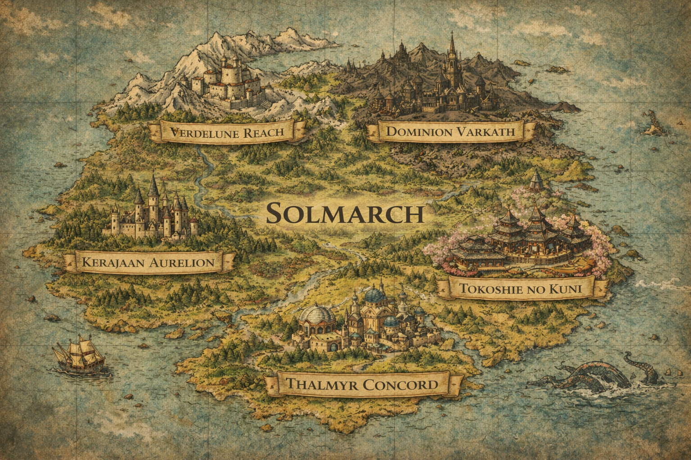

<p align="center">
  
</p>

<h1 align="center">⚔️ Solythis — D&D Campaign Vault</h1>

<p align="center">
  <em>A homebrew Dungeons & Dragons worldbuilding repository & interactive DM toolkit.</em>
</p>

<p align="center">
  
  
  
  
</p>

---

## 🌍 About

**Solythis** is an original high-fantasy world built from scratch for a D&D 5e (2024) campaign. This repository serves as the **single source of truth** for all worldbuilding, session materials, and interactive tools used to run the game.

The current campaign takes place in the **Kingdom of Aurelion** on the continent of **Solmarch** — a land shaped by ancient wars, political deception, and forces far beyond mortal understanding.

> *Everything in this vault is written in **Bahasa Indonesia**.*

---

## 🛠️ Interactive Tools

This project includes custom-built **single-file HTML tools** designed to enhance the tabletop experience. No frameworks, no build steps — just open in a browser.

| Tool | Description | Preview |
|---|---|---|
| **⚔️ Combat Tracker** | Drag-and-drop token battlemap with grid overlay, initiative tracker, HP management, and condition badges. Supports multiple maps. | `Battles/combat_tracker.html` |
| **📖 Monster Codex** | Searchable bestiary with official-style D&D stat blocks rendered on parchment, alphabet filtering, and monster artwork. | `Creatures or Monsters/Monster Codex.html` |
| **📜 Lore Reveal Tracker** | Timeline-based progress tracker for the DM to mark which lore pieces have been revealed to players. Includes DM notes and localStorage persistence. | `Lores/lore_reveal.html` |
| **🎬 Scene Viewer** | Cinematic slideshow presentation for displaying scene artwork to players during sessions. Features chapter tabs, keyboard shortcuts, autoplay, and fullscreen. | `Session/Aurelion/scene_viewer.html` |

### Tech Stack

All tools are built with:
- **Vanilla HTML / CSS / JavaScript** — zero dependencies
- **Google Fonts** — Cinzel, Lora, Plus Jakarta Sans, Outfit
- **Dark UI** with gold-accent design language throughout
- **localStorage** for data persistence (no server required)

---

## 📂 Project Structure

```
Solythis-DnD/
│
├── 📜 Adventures/          Campaign storylines & quest outlines
├── ⚔️ Battles/             Battle maps, encounter maps & combat tracker
├── 👤 Characters/          Player character sheets & NPC profiles
├── 🗺️ Continents/          World maps & regional cartography
├── 👹 Creatures or Monsters/   Monster codex, stat blocks & artwork
├── 🏴 Factions/            Organizations, guilds & political groups
├── 📖 Lores/               Deep lore documents, timelines & reveal tracker
├── ⛩️ Pantheons/           Deities & divine entities
├── 🕯️ Religion/            Belief systems & religious orders
├── 🎬 Session/             Session notes, scene art & scene viewer
└── 📋 logs/                Changelog & development notes
```

---

## 🎨 Design Philosophy

Every tool in this vault is built with a focus on **atmosphere and immersion**:

- 🌑 **Dark themes** that match the mood of a tabletop session
- ✨ **Gold & purple accents** inspired by the campaign's aesthetic
- 🖋️ **Serif typography** (Cinzel) for fantasy headers, paired with modern sans-serif for readability
- 🎭 **D&D-authentic styling** — stat blocks match official source material design
- ⚡ **Zero-dependency** — every tool is a single HTML file you can open offline

---

## 🚀 Getting Started

1. **Clone the repository**
   ```bash
   git clone https://github.com/Nothrovo/Solythis-DnD.git
   ```

2. **Open any `.html` tool** directly in your browser — no install needed.

3. **Browse the lore** starting from [`Lores/Aurelion Lores.md`](Lores/Aurelion%20Lores.md) for the campaign's core document.

> [!WARNING]
> **Players, stop here.** The lore documents and tracker tools contain major story spoilers. This vault is intended for the **Dungeon Master** only.

---

## 🗺️ World at a Glance

<table>
  <tr>
    <td align="center" width="50%">
      <br/>
      <sub><b>Kingdom of Aurelion</b></sub>
    </td>
    <td align="center" width="50%">
      <br/>
      <sub><b>Continent of Solmarch</b></sub>
    </td>
  </tr>
</table>

---

## 📌 Roadmap

- [x] Core worldbuilding & timeline
- [x] Combat Tracker with multi-map support
- [x] Monster Codex (Skeleton, Specter)
- [x] Lore Reveal Tracker
- [x] Scene Viewer with 11 scenes
- [ ] NPC Database & profiles
- [ ] Expanded bestiary entries
- [ ] Encounter tables per location
- [ ] Central dashboard / hub page
- [ ] Additional battle maps (Brackenford, Graymere)

---

<p align="center">
  <sub>Built with ☕ and 🎲 for the table.</sub><br/>
  <sub><b>Solythis-DnD</b> © 2026</sub>
</p>
